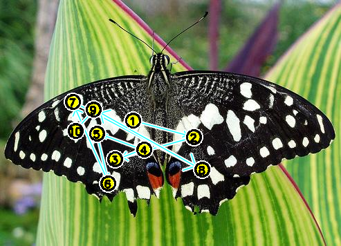
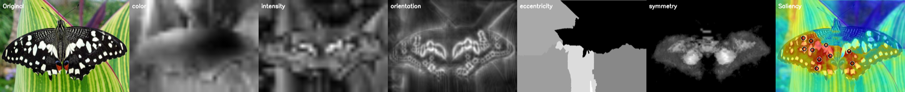

# Visual Attention Framework

A two-stage, biologically inspired visual-attention system in modern C++ — a
faithful, tested reimplementation of the model from my 2004 doctoral
dissertation, rebuilt in 2025–26.

[](https://github.com/OWNER/attention-framework/actions/workflows/ci.yml)
[](LICENSE)



*The model's scanpath: numbered fixations in the order attention visits them,
driven by bottom-up saliency and object-based inhibition of return. Reproduce with
`./build/attention data/samples/images/butterfly.jpg --no-display` (writes
`results/scan_path.png`).*

## What this is

Given an image — or a video / stereo stream — the system builds a **saliency
map** from biologically motivated features, selects attended locations, and
produces an ordered **scanpath**, maintaining **object files** across frames.
It reimplements the two-stage selection model from my dissertation (bottom-up
feature maps → an object-based attentive stage) as a clean, config-driven,
tested C++ system, with a Python layer that scores it against human fixations
and modern saliency models.

It is a **reference and reproducibility demonstrator**, not a state-of-the-art
computer-vision contribution — see [Context](#context--where-this-sits) below.

## How it works



*One image, decomposed: the input, per-feature maps (color, intensity,
orientation, eccentricity, symmetry) and the fused saliency map with detected
peaks.*

A frame flows through swappable stages, each selected by configuration:

> pyramids + Gabor banks → parallel feature extraction → fusion → selection
> (winner-take-all · 2D/3D neural field · Kalman-MOT) → object files + behaviour
> → focus + scanpath

State (neural-field activity, inhibition-of-return, object files) is carried
across frames in one explicit `RunState`, so a single image is just a stream of
length one. Full tour: [docs/ARCHITECTURE.md](docs/ARCHITECTURE.md).

## Quick start

### Build

Requires a C++17 compiler, CMake, OpenCV 4 and yaml-cpp (Catch2 is fetched
automatically for the tests).

```bash
# Debian/Ubuntu:  sudo apt-get install cmake g++ libopencv-dev libyaml-cpp-dev
# macOS:          brew install cmake opencv yaml-cpp
cmake -S . -B build -DCMAKE_BUILD_TYPE=Release
cmake --build build -j
```

### Run

```bash
# Single image → saliency map + scanpath overlay (in results/)
./build/attention data/samples/images/butterfly.jpg --no-display

# Classic (thesis) vs. modern feature profile on the same image
./build/attention --config configs/thesis.yaml data/test_images/inputc.png --no-display
./build/attention --config configs/modern.yaml data/test_images/inputc.png --no-display

# Live overlay on a webcam/video with per-object ROI processors (ESC to quit)
./build/attention --live 0 --config configs/live.yaml

# Emit the interchange format (JSON + 16-bit saliency PNG) for evaluation
./build/attention data/test_images/input.png --no-display --emit-json out/result.json
```

Every binary answers `--help`.

## Design decisions

The load-bearing choices are recorded as short ADRs:

- [C++ core, Python evaluation layer](docs/adr/0001-cpp-core-python-eval.md)
- [Registry- and config-driven strategies](docs/adr/0002-registry-config-driven-strategies.md)
- [File-based interchange instead of FFI](docs/adr/0003-file-interchange-not-ffi.md)

## Context — where this sits

Bottom-up, biologically inspired saliency (the Koch–Ullman / Itti–Koch /
guided-search lineage this model belongs to) is a **classic** computer-vision
topic. Since roughly 2014 it has been overtaken on free-viewing benchmarks by
learned models (DeepGaze and successors), which sit near the human
inter-observer ceiling. This project does not claim to compete there.

Its value is elsewhere: a faithful, legible, **engineered** reimplementation of
a specific two-stage attention model, with the modern comparison built in — the
repository benchmarks the thesis model head-to-head against modern saliency
operators and reports where it agrees and diverges
([docs/thesis_vs_modern.md](docs/thesis_vs_modern.md)). A fuller account of how
the approach relates to current human- and computer-vision attention research —
including where it could still be relevant — is in
[docs/RESEARCH_POSITIONING.md](docs/RESEARCH_POSITIONING.md).

The dissertation is open access: Backer, G. (2004). *Modellierung visueller
Aufmerksamkeit im Computer-Sehen: Ein zweistufiges Selektionsmodell für ein
Aktives Sehsystem.* PhD thesis, Universität Hamburg —
[ediss.sub.uni-hamburg.de](https://ediss.sub.uni-hamburg.de/volltexte/2004/2226/).

## Tests

```bash
ctest --test-dir build
```

Two layers against golden data in `tests/golden/`: **characterization** tests
(C++/Catch2 — feature and saliency maps within tolerance, refactor tripwires)
and **behavioural** tests (the CLI's interchange output compared by a Python
scanpath comparator — the project's loose-equivalence replication bar).

## Documentation

- [ARCHITECTURE.md](docs/ARCHITECTURE.md) — arc42-lite overview + diagrams, and the [ADRs](docs/adr/)
- [RESEARCH_POSITIONING.md](docs/RESEARCH_POSITIONING.md) — relation to current attention research
- [INTERCHANGE_FORMAT.md](docs/INTERCHANGE_FORMAT.md) — the result/scanpath format every model emits
- [thesis_vs_modern.md](docs/thesis_vs_modern.md) — thesis model vs. modern saliency models
- [ALTERNATIVE_FEATURES.md](docs/ALTERNATIVE_FEATURES.md) · [SELECTION_BACKENDS.md](docs/SELECTION_BACKENDS.md) — pluggable operators / trackers
- [PERFORMANCE.md](docs/PERFORMANCE.md) — timing and optimization notes
- Roadmaps: [V3_ROADMAP.md](docs/V3_ROADMAP.md) (current) · [V2_ROADMAP.md](docs/V2_ROADMAP.md) (history)

## How this was built

A 2025–26 reimplementation, developed with an agentic coding workflow (Claude
Code) under human direction: incremental, reviewed commits; ADR-recorded
decisions; tests and CI as guardrails. Commits are co-authored accordingly. The
exercise was as much about the engineering practice — a swappable, tested,
documented system — as about the algorithm.

## License

MIT — see [LICENSE](LICENSE).

## Citation

If you reference this work, please cite the dissertation:

> Backer, G. (2004). *Modellierung visueller Aufmerksamkeit im Computer-Sehen:
> Ein zweistufiges Selektionsmodell für ein Aktives Sehsystem.* PhD thesis,
> Universität Hamburg.
