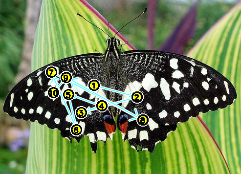
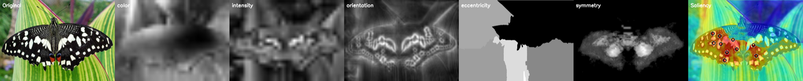

# Visual Attention

A two-stage, biologically inspired visual-attention system in modern C++: a
faithful, tested reimplementation of the model from my 2004 doctoral
dissertation, rebuilt in 2025–26 — and a research instrument built on it,
asking what a classic attention model is still good for, up to deciding where
a vision-language model spends its visual tokens.

[](https://github.com/gerriet/visual-attention/actions/workflows/ci.yml)
[](LICENSE)



*The model's scanpath: numbered fixations in the order attention visits them,
driven by bottom-up saliency and object-based inhibition of return. Reproduce with
`./build/attention data/samples/images/butterfly.jpg --no-display` (writes
`results/scan_path.png`).*

## What this is

Given an image — or a video / stereo stream — the system builds a **saliency
map** from biologically motivated features, selects attended locations, and
produces an ordered **scanpath**, maintaining **object files** across frames.
It reimplements the two-stage selection model from my dissertation (bottom-up
feature maps → an object-based attentive stage) as a clean, config-driven,
tested C++ system, with a Python layer that scores it against human fixations
and modern saliency models.

How faithful, component by component: stereo, the neural fields and — since
2026-09 — colour contrast (Munsell/MTM segmentation), eccentricity, symmetry
and the exclusivity weighting are ports of the original sources and the thesis's
equations; onset and the symbolic second stage are reconstructions from the
thesis text, because their sources did not survive. The
[replication dossier](docs/replication/REPLICATION_DOSSIER.md) re-runs the
thesis's own experiments — features, depth, and the dynamics of the neural
field, and the thesis's own test of its central claim: 22 of 25 findings reproduce
and 3 partially, the field's with the parameters the dissertation system actually
used. Tagged **`replication-v1`** (2026-09-21) and, after the second stage was
brought to the thesis's own chain — object files on the neural field's activity
clusters — **`replication-v2`** (2026-09-22); frozen since. Work beyond that is
on the modern system. `configs/thesis/` holds the dissertation profiles (the
replication track — finite, to be frozen when done); everything else is the
modern track, free to move away from the thesis
([ADR-0005](docs/adr/0005-two-tracks-replication-and-modern.md)).
`configs/default.yaml` adds Itti–Koch-style colour, intensity and orientation
features that the thesis did not have. Details and what is still open:
[docs/FEATURE_ASSESSMENT.md](docs/FEATURE_ASSESSMENT.md).

The thesis model is the **protected default**: every later addition — a
priority map with top-down and selection-history channels, persistent
identity-keyed object memory, proto-object segmentation, alternative feature
operators and selection backends — is opt-in, and the golden tests keep the
default path stable. On that base the repository runs a series of studies
(H1–H7, below) asking where the model still earns its keep, from object-based
inhibition of return in dynamic scenes to allocating a vision-language model's
token budget. It is not a state-of-the-art saliency contribution — see
[Context](#context--where-this-sits) below.

## How it works



*One image, decomposed: the input, per-feature maps (color, intensity,
orientation, eccentricity, symmetry) and the fused saliency map with detected
peaks.*

A frame flows through swappable stages, each selected by configuration:

> pyramids + Gabor banks → parallel feature extraction → fusion → selection
> (winner-take-all · 2D/3D neural field · Kalman-MOT) → object files + behaviour
> → focus + scanpath

State (neural-field activity, inhibition-of-return, object files) is carried
across frames in one explicit `RunState`, so a single image is just a stream of
length one. Full tour: [docs/ARCHITECTURE.md](docs/ARCHITECTURE.md).

## Quick start

### Build

Requires a C++17 compiler, CMake, OpenCV 4 and yaml-cpp (Catch2 is fetched
automatically for the tests).

```bash
# Debian/Ubuntu:  sudo apt-get install cmake g++ libopencv-dev libyaml-cpp-dev
# macOS:          brew install cmake opencv@4 yaml-cpp   (Homebrew's `opencv` is 5.x)
cmake -S . -B build -DCMAKE_BUILD_TYPE=Release
cmake --build build -j
```

### Run

```bash
# Single image → saliency map + scanpath overlay (in results/)
./build/attention data/samples/images/butterfly.jpg --no-display

# The dissertation profile, the best modern profile (today it starts equal to
# the thesis one — see configs/modern.yaml), and the old five-feature default
./build/attention --config configs/thesis/thesis.yaml data/test_images/inputc.png --no-display
./build/attention --config configs/modern.yaml data/test_images/inputc.png --no-display
./build/attention --config configs/thesis-extended.yaml data/test_images/inputc.png --no-display

# Live overlay on a webcam/video with per-object ROI processors (ESC to quit)
./build/attention --live 0 --config configs/live.yaml

# Recognition gated by attention: detectors run only on attended regions,
# labels accumulate on tracked object files ("person #3")
./build/attention --attend data/samples/video/vtest.avi \
    --processors hog-person --behavior identification --no-save-frames

# Priority-map search: fold a top-down task channel (here, a target colour)
# into the saliency map to guide attention toward the target
./build/attention --config configs/find_red.yaml data/test_images/inputc.png --no-display

# Dynamic-IOR ablation: one system, three inhibition behaviours
./build/attention --attend data/samples/video/vtest.avi --behavior object-ior \
    --emit-scanpath results/scanpath.json --no-save-frames

# Emit the interchange format (JSON + 16-bit saliency PNG) for evaluation
./build/attention data/test_images/input.png --no-display --emit-json out/result.json
```

Every binary answers `--help`.

### Evaluation layer

The studies live in Python on top of the interchange format (see
[eval/README.md](eval/README.md)); the VLM studies talk to a **local**
open-weights model through [Ollama](https://ollama.com) by default, so they
need no API key.

```bash
python3 -m venv eval/.venv && eval/.venv/bin/pip install -r eval/requirements.txt
ollama pull qwen3.8:27b        # or --backend claude, or --backend mock (no model)

# Attention as a VLM token budget, on stills (V*Bench) — with the oracle and
# question-conditioned arms, and real token counts
eval/vlm_frontend.py --vstar --limit 20 --count-tokens --oracle --top-down

# Object files as a video token cache, on synthetic dynamic scenes
eval/vlm_video.py --seeds 5 --count-tokens --config configs/attend_proto.yaml \
    --tag-size 8 --min-target-px 5
```

## What it found

Each study is a controlled ablation with its own document; negatives are kept
and reported.

- **Object-based inhibition of return in dynamic scenes (H1): supported.** 30
  fresh scenes per regime, predictions written down beforehand (pessimistic
  ones — three of four were refuted): object-based IOR reaches new objects
  sooner than space-based IOR (latency −0.5 / −4.4 / −2.6 frames) *and* keeps
  cycling through the scene more evenly, in every regime, also against a
  motion-compensated location tag. The project's earlier "honest negative" on
  this was about the reimplementation, not the thesis: it was measured on
  stage-1 features that were not the thesis's — found and fixed by the
  replication dossier.
  [DYNAMIC_IOR_STUDY.md](docs/DYNAMIC_IOR_STUDY.md)
- **Scanpaths vs human gaze on stills (H4).** On all 1003 MIT1003 images the
  thesis model's scanpath is measurably above random, by little, well below
  "stay in the middle", and far from human-vs-human agreement; the second
  stage's ordering does not help on stills — its benefit is in dynamic scenes
  (H1). A side result: ScanMatch cannot tell the constant-centre path from the
  inter-observer ceiling on this dataset. [SCANPATH_VS_HUMAN.md](docs/SCANPATH_VS_HUMAN.md)
- **Recognition gated by attention (H2).** Detectors restricted to attended
  ROIs recover 51% of all full-frame detections at 5.8% of the pixels.
  [GATED_RECOGNITION.md](docs/GATED_RECOGNITION.md)
- **Priority map (H5).** A top-down target channel is decisive for search; a
  category prior helps on COCO-Search18. [PRIORITY_MAP.md](docs/PRIORITY_MAP.md)
- **Attention as a VLM token budget, stills (H6).** Crops on the *right*
  region beat full resolution at a third of the tokens — but bottom-up crops
  land on the target on only 10% of V\*Bench items; question-conditioned crops
  lift that to 65% and still don't beat a same-budget uniform downsample.
  [VLM_FRONT_END.md](docs/VLM_FRONT_END.md)
- **Object files as a video token cache (H7).** At a matched token budget on
  synthetic video, with a local open-weights VLM: crops keyed by *object file*
  0.95, by *location* 0.80, budget-matched whole frames 0.27 (chance 0.25).
  On DAVIS-2017 every arm ties, at 480p *and* at full resolution: the
  "which of these appears?" question survives downsampling, so the budget
  never binds. Testing this on real video needs questions about fine detail.
  [VLM_VIDEO.md](docs/VLM_VIDEO.md)

Where this stands for a publication, and what a reviewer would object to:
[PAPER_READINESS.md](docs/PAPER_READINESS.md).

## Design decisions

The load-bearing choices are recorded as short ADRs:

- [C++ core, Python evaluation layer](docs/adr/0001-cpp-core-python-eval.md)
- [Registry- and config-driven strategies](docs/adr/0002-registry-config-driven-strategies.md)
- [File-based interchange instead of FFI](docs/adr/0003-file-interchange-not-ffi.md)
- [IOR as a controlled ablation, and an honest negative result](docs/adr/0004-ior-ablation-honest-negative-result.md)
- [Two tracks: a finite replication, an open-ended modern system](docs/adr/0005-two-tracks-replication-and-modern.md)

## Context — where this sits

Bottom-up, biologically inspired saliency (the Koch–Ullman / Itti–Koch /
guided-search lineage this model belongs to) is a **classic** computer-vision
topic. Since roughly 2014 it has been overtaken on free-viewing benchmarks by
learned models (DeepGaze and successors), which sit near the human
inter-observer ceiling. This project does not claim to compete there.

Its value is elsewhere: a faithful, legible, **engineered** reimplementation of
a specific two-stage attention model, with the modern comparison built in — the
repository benchmarks the thesis model head-to-head against modern saliency
operators and reports where it agrees and diverges
([docs/thesis_vs_modern.md](docs/thesis_vs_modern.md)). The question it
pursues now is narrower and more current: large vision models pay for every
visual token, and an interpretable, stateful controller that says *where to
spend them* is something learned saliency models don't offer — what that buys,
and where it doesn't, is measured in the H6 and H7 studies above. A fuller account of how
the approach relates to current human- and computer-vision attention research —
including where it could still be relevant — is in
[docs/RESEARCH_POSITIONING.md](docs/RESEARCH_POSITIONING.md).

The dissertation is open access: Backer, G. (2004). *Modellierung visueller
Aufmerksamkeit im Computer-Sehen: Ein zweistufiges Selektionsmodell für ein
Aktives Sehsystem.* PhD thesis, Universität Hamburg —
[ediss.sub.uni-hamburg.de](https://ediss.sub.uni-hamburg.de/handle/ediss/719).

## Tests

```bash
ctest --test-dir build
```

Against golden data in `tests/golden/`: **characterization** tests (C++/Catch2
— feature and saliency maps within tolerance, refactor tripwires) and
**behavioural** tests (the CLI's interchange output compared by a Python
scanpath comparator — the project's loose-equivalence replication bar). The
same suite runs the evaluation layer: Python unit tests and one smoke per
study, each on a deterministic mock backend, so no model or dataset is needed
to check that everything still works.

## Documentation

- [ARCHITECTURE.md](docs/ARCHITECTURE.md) — arc42-lite overview + diagrams, and the [ADRs](docs/adr/)
- [RESEARCH_POSITIONING.md](docs/RESEARCH_POSITIONING.md) — relation to current attention research
- [INTERCHANGE_FORMAT.md](docs/INTERCHANGE_FORMAT.md) — the result/scanpath format every model emits
- [thesis_vs_modern.md](docs/thesis_vs_modern.md) — thesis model vs. modern saliency models
- [ALTERNATIVE_FEATURES.md](docs/ALTERNATIVE_FEATURES.md) · [SELECTION_BACKENDS.md](docs/SELECTION_BACKENDS.md) — pluggable operators / trackers
- [DYNAMIC_IOR_STUDY.md](docs/DYNAMIC_IOR_STUDY.md) · [GATED_RECOGNITION.md](docs/GATED_RECOGNITION.md) · [SCANPATH_VS_HUMAN.md](docs/SCANPATH_VS_HUMAN.md) · [PRIORITY_MAP.md](docs/PRIORITY_MAP.md) · [VLM_FRONT_END.md](docs/VLM_FRONT_END.md) · [VLM_VIDEO.md](docs/VLM_VIDEO.md) — the H1, H2, H4, H5, H6 and H7 studies
- [REPLICATION_DOSSIER.md](docs/replication/REPLICATION_DOSSIER.md) — the dissertation's own findings, re-run: eccentricity, colour contrast, symmetry and exclusivity replicate; what was not attempted yet
- [PAPER_READINESS.md](docs/PAPER_READINESS.md) — what could be published, and what is missing
- [CRITICAL_REVIEW_2026-09.md](docs/CRITICAL_REVIEW_2026-09.md) · [HYPOTHESIS_CLOSURE_PLAN.md](docs/HYPOTHESIS_CLOSURE_PLAN.md) · [FEATURE_ASSESSMENT.md](docs/FEATURE_ASSESSMENT.md) — the 2026-09 review: what is solid, what is not, and the plan to close the open hypotheses
- [PERFORMANCE.md](docs/PERFORMANCE.md) — timing and optimization notes
- Roadmaps: [V3_ROADMAP.md](docs/V3_ROADMAP.md) (current) · [V2_ROADMAP.md](docs/V2_ROADMAP.md) (history)

## How this was built

A 2025–26 reimplementation, developed with an agentic coding workflow (Claude
Code) under human direction: incremental, reviewed commits; ADR-recorded
decisions; tests and CI as guardrails. Commits are co-authored accordingly. The
exercise was as much about the engineering practice — a swappable, tested,
documented system — as about the algorithm.

## License

MIT — see [LICENSE](LICENSE).

## Citation

If you reference this work, please cite the [dissertation](https://ediss.sub.uni-hamburg.de/handle/ediss/719):

> Backer, G. (2004). *Modellierung visueller Aufmerksamkeit im Computer-Sehen:
> Ein zweistufiges Selektionsmodell für ein Aktives Sehsystem.* PhD thesis,
> Universität Hamburg.
