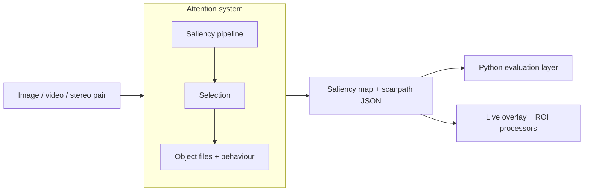
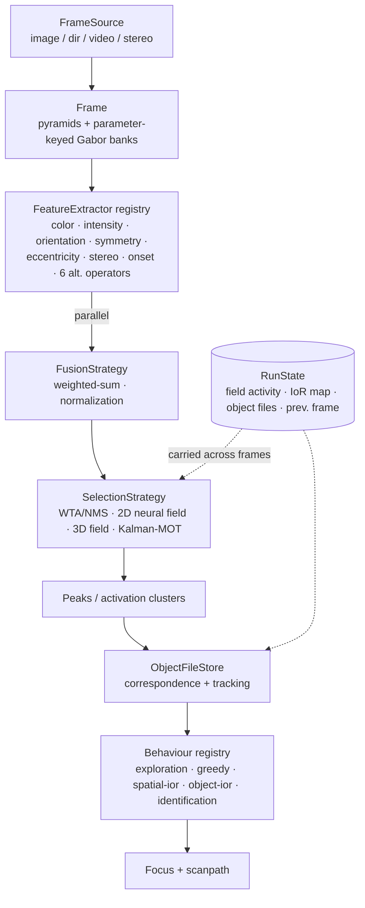

# Architecture overview (arc42-lite)

A short, arc42-shaped tour of the system. Deeper design rationale lives in the
[ADRs](adr/); this document is the map.

## 1. Introduction and goals

A two-stage, biologically inspired **visual-attention** system: it turns an
image (or a video stream) into a **saliency map**, then into an ordered
**scanpath** of attended locations, maintaining **object files** across frames.
It is a faithful, tested reimplementation of the model from the author's 2004
dissertation (see the README's *Context* section for where this sits relative
to modern deep-learning saliency).

Quality goals, in order:

1. **Faithfulness** — behaviourally equivalent to the thesis model on its test
   images (loose equivalence: same regions, similar order — not pixel parity).
2. **Swappability** — features, fusion, selection, behaviours and downstream
   processors are exchangeable by configuration, so classic and modern variants
   are compared under one harness.
3. **Reproducibility** — one build, deterministic tests, a documented result
   format any model (C++ or Python) emits.

## 2. Constraints

- **C++17 core** (the original was C++), OpenCV for image ops, yaml-cpp for
  configuration; **Python** only for the evaluation layer. See [ADR-0001](adr/0001-cpp-core-python-eval.md).
- The two languages meet at a **file-based interchange format**, not FFI. See
  [ADR-0003](adr/0003-file-interchange-not-ffi.md).
- The pipeline is **stream-oriented and stateful**: a single image is a stream
  of length one.

## 3. Context

Every model — the C++ pipeline or a Python model — emits the same interchange
artifact (a saliency map plus a result JSON). The evaluation layer only ever
consumes that format, so adding a model never touches the harness.

## 4. Building blocks

Each stage behind a **registry** (feature / fusion / selection / behaviour /
processor) is selected by name from YAML, so composition is fully
config-driven — no code change to swap a strategy. See
[ADR-0002](adr/0002-registry-config-driven-strategies.md).

## 5. Runtime view

Per frame of the stream:

1. `FrameSource` yields a `Frame`; the pipeline precomputes shared pyramids and
   the parameter-keyed Gabor banks **once**, before parallel extraction.
2. Enabled `FeatureExtractor`s run in parallel; `FusionStrategy` combines their
   maps into one saliency map.
3. `SelectionStrategy` reduces the map to peaks / activation clusters, reading
   and updating `RunState` (neural-field activity, inhibition-of-return) so
   dynamics carry across frames.
4. The second stage corresponds clusters to `ObjectFile`s and a `Behaviour`
   picks the focus. The default (`exploration`) dwells then applies object-based
   inhibition of return; the M12 ablation arms (`greedy` / `spatial-ior` /
   `object-ior`) and the M13 `identification` behaviour swap into the same slot.
   The scanpath is extended.
5. Optionally, downstream **processors** run only on attended ROIs (the
   attention premise made concrete: expensive analysis where the system looks) —
   under `--live` and headless under `--attend`, where gated recognition
   accumulates their verdicts into per-object label memory (M13).

## 6. Cross-cutting concepts

- **State** lives in one explicit `RunState`, not scattered statics — the reason
  motion, field dynamics and tracking compose cleanly.
- **Determinism**: fixed iteration counts and seeded synthetic fixtures make the
  golden tests reproducible.
- **Two test layers**: C++ characterization goldens (map tolerances) and
  behavioural scanpath goldens (position/order tolerance) — the actual
  replication bar.

## 7. Key decisions

- [ADR-0001](adr/0001-cpp-core-python-eval.md) — C++ core, Python evaluation layer.
- [ADR-0002](adr/0002-registry-config-driven-strategies.md) — registry- and config-driven strategies.
- [ADR-0003](adr/0003-file-interchange-not-ffi.md) — file-based interchange instead of FFI.
