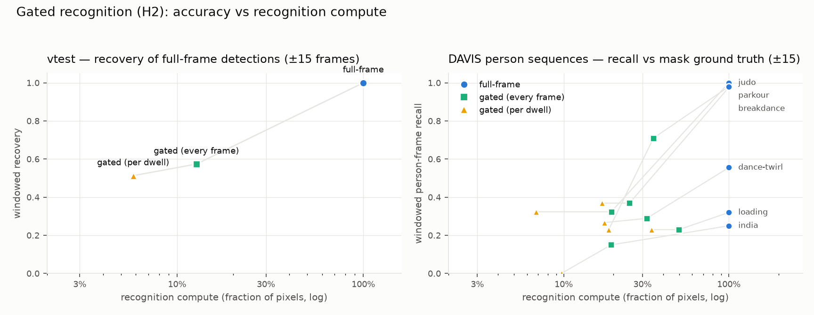

# Gated recognition — attention-gated perception (M13, H2)

*Status: first full pass, 2026-07. Code: recognition processors + label memory
+ the `identification` behavior; experiments below are reproducible from one
command each.*

**H2 — Gated recognition.** *Recognition restricted to attended ROIs reaches
near-full-frame accuracy at a fraction of the compute; the gap narrows as
scene clutter grows.*

This milestone turns the attention premise into a measurable compute argument:
expensive analysis runs only where the system is looking. The M8 processor
architecture already ran plugins on attended ROIs in the live demo; M13 makes
processors *recognizers*, runs them headless under `--attend`, accumulates
their verdicts into per-object **label memory**, and closes the loop with a
behavior in which *being identified* is what inhibits attention.

## The pieces

| Piece | What it is |
|---|---|
| `hog-person` | OpenCV HOG pedestrian detector on the attended ROI (Tier 1, zero deps) |
| `haar-face` | OpenCV Haar frontal-face cascade on the attended ROI (Tier 1) |
| `dnn-classify` | any ImageNet-style ONNX classifier via `cv::dnn` (Tier 2); `dnn-classify:<model>:<labels>[:<size>]`, weights via `tools/fetch_models.py` (never committed) |
| Label memory | per-object vote histogram → majority label + mean confidence + vote count + inspection count ("person #3") |
| `identification` | stage-2 behavior: unidentified objects attract the focus (least-inspected first); confidently labeled — or repeatedly unlabelable — objects drop into the background rotation. Semantic IOR, i.e. curiosity |
| Cadence | `--process-cadence dwell` (default: once per focus visit, the thesis's ~3-frame attentive computation), `frame` (every focused frame), `full-frame` (ungated baseline) |
| Interchange | additive `annotations` / `labels` / `processing` fields in `attention-scanpath/v1` (see `docs/INTERCHANGE_FORMAT.md`) |

Everything is opt-in; `--attend` without `--processors` is unchanged.

```bash
# gated recognition over a stream, labels accumulating on object files
./build/attention --attend data/samples/video/vtest.avi \
    --processors hog-person --behavior identification \
    --emit-scanpath results/scanpath.json --no-save-frames

# the H2 study
eval/gated_recognition.py --video data/samples/video/vtest.avi --frames 300
eval/gated_recognition.py --davis        # needs data/DAVIS (adapter docstring)
eval/plot_gated_recognition.py results/gated_recognition/summary.json \
    results/gated_recognition_davis/summary.json
```

## Experiment design

Both arms run the **same detector through the same binary** over the same
stream; only the gating differs. Compute is counted as **pixels handed to the
detector** (hardware-independent; wall-clock reported alongside). Scores use
an IoU ≥ 0.3 match and are reported **strict** (same frame) and **windowed**
(±15 frames): attention inspects one object per frame, so the fair claim is
recovery *within a small latency*, not simultaneous omniscience.

- **vtest (self-relative).** No person ground truth exists, so the full-frame
  arm's detections are the reference and the gated arm is scored on how many
  of them it recovers. This includes the baseline's false positives — honest
  in both directions (the gated arm is not punished for skipping a bush only
  if attention also visits the bush).
- **DAVIS 2017 (real ground truth).** Person boxes derived from the
  segmentation masks (`eval/datasets/davis2017.py`; the person↔object-id map
  is hand-curated against first-frame mask overlays — DAVIS itself has no
  class labels). Here *both* arms are scored against the truth, so the
  baseline's own weakness is visible.

## Results



**vtest, 300 frames, 854 full-frame detections as reference:**

| cadence | strict | windowed (±15) | pixels | wall-clock |
|---|---|---|---|---|
| gated, per dwell | 0.048 | **0.513** | **5.8%** | 5.0% |
| gated, every frame | 0.111 | 0.574 | 12.7% | 11.9% |
| full-frame | 1.0 (by construction) | 1.0 | 100% | 100% |

At **5.8% of the recognition pixels, the gated system recovers 51% of
everything the full-frame detector ever found** (within half a second at
25 fps). Pixels are counted as what the detector *actually scanned* — including
`hog-person`'s internal upscaling of small ROIs — which is why the pixel and
wall-clock columns agree; charging only the handed-in ROI would flatter the
gated arms by ~2×. Label memory concentrates the semantics: 128 distinct
object files inspected (per-dwell ≈ one look each — the curiosity economy), 26
of them accumulating stable "person" identities.

**DAVIS person sequences (windowed person-frame recall vs mask GT):**

| sequence | full-frame | gated per-dwell (px) | gated every-frame (px) |
|---|---|---|---|
| breakdance | 0.98 | 0.37 (17%) | 0.37 (25%) |
| dance-twirl | 0.56 | 0.27 (18%) | 0.29 (32%) |
| india | 0.25 | 0.00 (10%) | 0.15 (19%) |
| judo | 1.00 | 0.32 (7%) | 0.32 (19%) |
| loading | 0.32 | 0.23 (34%) | 0.23 (50%) |
| parkour | 0.98 | 0.23 (19%) | 0.71 (35%) |

## Reading the results honestly

**Where H2 holds.** On the multi-pedestrian surveillance scene (vtest) the
trade is excellent: half the detections for a seventeenth of the compute. This
is H2's clutter clause in action — many small objects means full-frame
scanning wastes almost all of its pixels on empty pavement, and attention's
prioritization is nearly free accuracy.

**Where it doesn't (and why — the useful part).** On DAVIS single-actor
sequences the gated arms clearly lag the baseline. Instrumenting *why*
decomposes the gap cleanly, because the two failure modes separate:

- **Detector-limited (parkour):** attention focused the athlete in 29 frames,
  but HOG recognized only 17% of those crops (vaulting ≠ upright pedestrian).
  With per-dwell cadence a missed look is a missed visit; every-frame cadence
  retries during the dwell and triples recall (0.23 → 0.71) — re-inspection
  compensates for a weak recognizer.
- **Allocation-limited (judo):** HOG hit 100% of the crops attention gave it —
  but attention looked at the judoka in only 3 frames (low-contrast figures on
  a bright hall floor; saliency goes elsewhere). No amount of recognition
  fixes not looking.
- **Healthy (breakdance):** 28 looks, 71% hit rate; the remaining gap is the
  crowd competing for fixations, i.e. the price of covering the whole scene
  rather than staring at one dancer — which is the point of exploration.

Also honest: full-frame HOG is itself weak on DAVIS (windowed recall 0.25–0.56
on india/loading/dance-twirl) — deformable poses at 480p are simply not its
regime, which caps what any gating can recover. The DAVIS pixel fractions
(7–50%) are worse than vtest's 6% because one large actor plus ROI margin is a
big crop amortized over a short clip. And the compute axis counts *recognition*
pixels only: the attention pipeline that does the gating is not free
(`docs/PERFORMANCE.md`). In this system it is shared infrastructure — object
files, scanpaths, and IOR exist regardless of recognition — but a deployment
that wants nothing except detections would have to charge the pipeline against
the gating. The argument scales in gating's favor as the recognizer gets more
expensive per pixel (a DNN or VLM instead of HOG), which is exactly the M18
direction.

**Sharper H2** (mirroring M12's sharpened H1): gated recognition wins
decisively where scenes are *cluttered with many small objects* and the
recognizer is competent on the attended crops; with a single large actor the
gap is set by detector robustness (fixable with re-inspection or a better
Tier-2 model) or by salience failing to prioritize the actor (a stage-1
problem that recognition compute cannot buy back). The M17 priority map's
top-down channel is the natural fix for the latter — "attend the person-like
things" is exactly a task prior.

**Label memory inherits tracker identity stability** — the M12 finding
resurfaces here, as predicted. On deformable single actors (dance-twirl) the
saliency segmentation churns object files every few frames, so votes scatter
across short-lived identities instead of accumulating on one; on vtest's
rigid, well-separated pedestrians, identities persist and 26 objects reach
stable "person" labels. Anything that improves correspondence
(`--appearance-matching`, `--motion-prediction`, the Kalman backend) directly
improves semantic identity — the H1 and H2 threads share a bottleneck.

**A note on `dnn-classify`:** the mechanism works (differentiated softmax over
1000 classes on attended crops), but ImageNet has no "person" class — on
surveillance crops it answers things like "unicycle". It earns its keep as
the generic Tier-2 slot (any ONNX classifier by config) and as the vote
plumbing the M18 VLM captioner will reuse, not as the H2 accuracy engine.

## Knobs (defaults chosen here)

| Knob | Default | Meaning |
|---|---|---|
| `--process-cadence` | `dwell` | when recognition fires (see above) |
| `process_repeat_frames` | 3 | per-dwell: a continuously held focus re-fires every this many frames — a held focus is a *sequence* of attentive computations, so a persistent object can still accumulate the votes to settle |
| `--roi-margin` | 0.25 | bbox expansion per side before recognition (detector context; the live demo applies the same margin) |
| `Identification::Params` | conf ≥ 0.5, 2 votes, give-up at 6 inspections, dwell 3 | when an object counts as identified / abandoned |
| study `--iou` / `--window` / `--min-conf` | 0.3 / ±15 / 0.2 | match threshold, recovery latency, confidence floor (both arms) |

## Files

- `src/system/processor.cpp` — processors + registry (spec syntax `name:config`)
- `src/system/object_file.{h,cpp}` — `LabelMemory`, vote/inspection APIs
- `src/system/behavior.cpp` — `Identification`
- `src/system/attention_system.cpp` — gated processor loop, cadence, compute stats
- `eval/gated_recognition.py`, `eval/plot_gated_recognition.py` — the study
- `eval/datasets/davis2017.py` — DAVIS adapter + curated person ids
- `tools/fetch_models.py` — ONNX weights (SqueezeNet 1.1 default, MobileNetV2 `--all`)
- `tests/test_recognition.cpp`, CTest `gated_recognition_smoke` + help tests
