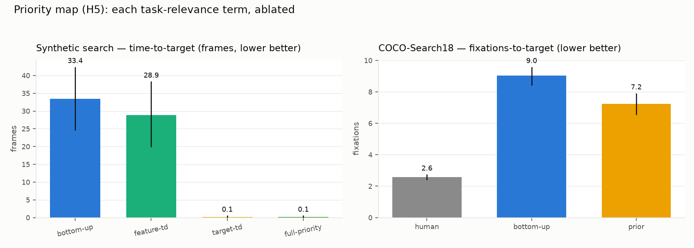

# Priority map — the two missing terms (M17, H5)

*Status: first full pass, 2026-07. Code: a `PriorityConfig` fusion extension
(top-down + history/value channels) + the H5 study on synthetic search and
COCO-Search18. Reproducible from one command each.*

**H5 — Priority map beats salience-only for task-driven search.** *Adding a
top-down/task channel and a selection-history/value term to the master map
improves target-finding efficiency over bottom-up-only, and each term
contributes measurably (ablation).*

The thesis fuses feature maps into a single **saliency map** — purely
bottom-up. The modern unifying construct is a **priority map** (Wolfe's Guided
Search 6.0; Awh, Belopolsky & Theeuwes): bottom-up salience **+** top-down task
relevance **+** selection history / value. M17 adds the two missing terms as
opt-in weighted channels. With every added weight at zero the map is
*bit-identical* to the thesis map (the default; the characterization goldens
are untouched), so this generalizes the 2004 model without changing it.

## The terms

```
priority = bottom_up
         + w_td  · top_down_relevance      (pipeline level; stills & streams)
         + w_obj · object_value            (stage 2; rides on object files)
         + w_loc · location_history        (stage 2; decaying attended-location map)
```

| Channel | What it is | Where |
|---|---|---|
| Feature-dimension top-down | Per-feature fusion weights (already config-driven) — Guided Search's dimension weighting; a "boost colour" target spec is just a higher `color` weight. No new mechanism. | fusion weights |
| Dense top-down (`target_color`) | Chroma-weighted Lab similarity to a target colour — the zero-dependency channel that makes find-my-object work out of the box. | `TopDownChannel` |
| Dense top-down (`top_down_map`) | An external grayscale relevance map, resized and fused. The **interchange-boundary slot**: a CLIP / open-vocab detector / LLM adapter writes it Python-side; the core neither knows nor cares what produced it. Shared with M18. | `TopDownChannel` |
| Object value | Facilitation that **rides on the object file** — accrues on selection and via an external reward hook (`ObjectFileStore::add_value`, e.g. a target-label match from M13), decays, and is projected at the object's *current* position. Distinct from IOR, which only suppresses. | `HistoryChannels` |
| Location history | The literature's decaying map of recently attended locations. | `HistoryChannels` |

Config (`configs/*.yaml`), all optional:

```yaml
priority:
  top_down_weight: 1.5
  target_color: red          # or "#rrggbb", or omit
  top_down_map: relevance.png # external dense channel, or omit
  object_value_weight: 0.6
  location_history_weight: 0.2
```

```bash
# colour-guided search on a still
./build/attention --config configs/find_red.yaml scene.png --no-display

# the H5 study
eval/priority_search.py --seeds 20           # synthetic ablation
eval/coco_search.py --limit 150              # COCO-Search18 (needs the dataset)
eval/plot_priority_search.py results/priority_search/summary.json \
    results/coco_search/summary.json
```

## Results



**Synthetic search** (one red target among 5 coloured distractors, 20 seeds,
60-frame penalty; time-to-target = frames until the focus first lands on the
target):

| arm | time-to-target | hold-fraction |
|---|---|---|
| bottom-up | 33.4 [24.8, 42.3] | 0.16 |
| feature-td (colour dimension ×3) | 28.9 [20.0, 38.2] | 0.23 |
| target-td (dense colour channel) | **0.1 [0.0, 0.5]** | 0.10 |
| full-priority (target-td + history) | 0.1 [0.0, 0.5] | **0.16** |

**COCO-Search18** (target-present, 150 validation trials, 10-fixation budget;
mean fixations-to-target, cap+1 when never found):

| arm | mean fixations-to-target | found@10 |
|---|---|---|
| human (1375 correct trials) | 2.58 [2.43, 2.72] | 0.92 |
| bottom-up | 9.03 [8.43, 9.56] | 0.27 |
| prior (category prior in the channel) | **7.23 [6.57, 7.89]** | **0.52** |

*(Human fixations-to-target excludes the enforced central start fixation and
is capped at the model's budget, so all three rows are on one scale.)*

## Reading the results

**Each term earns its weight — or honestly fails to.** The ablation separates
the two forms of "top-down," which the literature often conflates:

- **Feature-*dimension* weighting barely moves the synthetic needle** (33.4 →
  28.9, CIs overlap bottom-up). This is the expected null, and it's worth
  stating plainly: boosting the *colour dimension* cannot select a colour
  *value* when every distractor is also colourful — Guided Search's weight
  vector selects which feature to trust, not which value to seek. A target that
  popped out by orientation-among-verticals would tell the opposite story; the
  point is that the mechanism is real but narrow.
- **The dense target channel is decisive** where the dimension weight is not
  (28.9 → 0.1): a value-specific relevance map finds the red target almost
  immediately. This is the term that turns "salience" into "priority."
- **The history/value term shows up in *hold*, not *acquisition*** (0.10 →
  0.16 target-hold once found). That is exactly where facilitation should act:
  it competes with exploration's inhibition of return, keeping attention on a
  valued object slightly longer. It is a small, correct effect — value
  facilitation and IOR are designed to pull in opposite directions.

**On real images the channel helps and the honesty holds.** On COCO-Search18 a
*content-blind* category prior — where targets of this class tended to appear
in the **training** split, never anything about the test image — cuts mean
fixations-to-target 9.03 → 7.23 (non-overlapping CIs) and nearly doubles
found@10 (0.27 → 0.52). Two honest framings:

- This is a **lower bound** on the channel's value. The prior is deliberately
  weak (a spatial blob per category); a semantic source in the same slot (CLIP
  patch-similarity, an open-vocabulary detector, an LLM) sees the actual image
  and should do strictly better. That upgrade is M18's, and it needs no core
  change — it writes the same `top_down_map`.
- The model stays **well short of human** (7.23 vs 2.58; found@10 0.52 vs
  0.92). A bottom-up-plus-prior controller is not a search model of human
  gaze, and this milestone does not claim to be one. What H5 claims — that the
  priority terms improve task-driven efficiency, separably — is supported on
  both the controlled and the natural benchmark.

**Sharper H5:** the priority map beats salience-only for task search, but the
gain is carried by the *value-specific* top-down term (a dense relevance map),
not by feature-dimension weighting, and the history/value term buys engagement
rather than acquisition. The single highest-leverage next step is a semantic
source for the dense channel — which is where M18 comes in, and which this
milestone has already wired a slot for.

## Knobs (defaults)

| Knob | Default | Meaning |
|---|---|---|
| `top_down_weight` | 0 (off) | weight of the dense top-down channel |
| `target_color` / `target_color_sigma` | — / 25 | target colour + Lab-distance falloff |
| `top_down_map` | — | external grayscale relevance-map path |
| `object_value_weight` | 0 (off) | facilitation weight for object value |
| `object_value_per_selection` / `object_value_decay` | 0.2 / 0.98 | value accrued per focus / per-frame leak |
| `location_history_weight` | 0 (off) | weight of the decaying location map |
| `location_history_decay` / `location_history_radius` | 0.95 / 40 | its per-frame decay / splat radius |

## Files

- `include/attention/fusion/priority_map.h`, `src/fusion/priority_map.cpp` — the channels
- `src/pipeline/attention_pipeline.cpp` — top-down folded in at fusion
- `src/system/attention_system.cpp` — history channels in the second stage; value hook
- `src/config/config_loader.cpp` — the `priority:` YAML block
- `eval/priority_search.py` + `tools/make_dynamic_scene.py --target` — synthetic H5
- `eval/coco_search.py`, `eval/datasets/cocosearch18.py` — COCO-Search18 arm
- `eval/plot_priority_search.py` — the figure
- `tests/test_priority.cpp`, CTest `priority_search_smoke` + help tests
