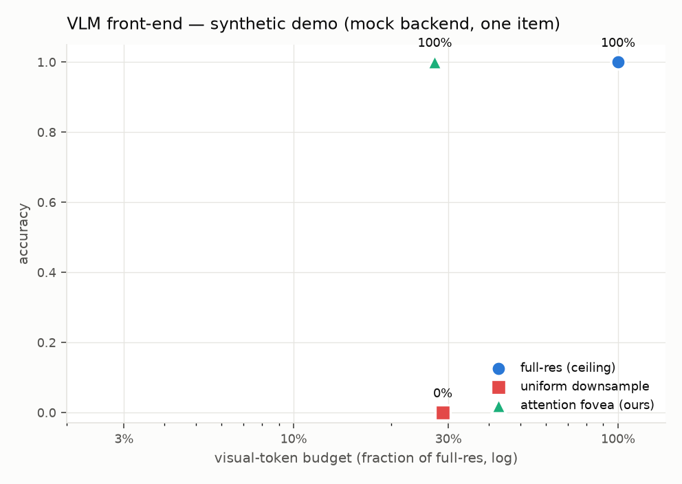

# Attention as a VLM token-budget allocator (M18, H6)

*Status: instrument built and verified end-to-end on a mock backend, 2026-07.
The real V\*Bench measurement is gated on a VLM backend + credentials (see
"Running it for real"); the headline numbers land when that runs.*

**H6 — Attention as a VLM token budget.** *Feeding a vision-language model only
the attended ROIs (fovea) plus a low-res global view preserves task accuracy at
a large fraction of the visual tokens/FLOPs of the full-resolution image, and
the saving grows with input resolution.*

This is the milestone that reframes the whole instrument: not "a 2004 thesis
reimplementation" but a **stateful, interpretable, model-free attention
front-end for large vision models**. Modern VLMs pay for every visual token, and
on high-resolution inputs they either burn tokens on the full image or downsample
and go blind to small objects. The attention pipeline is a cheap controller that
says *where to spend the tokens* — the GazeVLM / "gaze tells you where to
compute" recipe, with an interpretable mechanism in the driver's seat. The
non-goal (guarded): stay the controller, don't become another VLM.

## How it works

The whole front-end rides the existing interchange output — **no new C++ mode**
for this first cut (the full C++ virtual fovea is M15's job). Per image+question:

1. Run the pipeline (`attention <image> --emit-json`) to get the attention
   fixations — the top-K salient points, ranked.
2. Crop a fixed-size **fovea window** at native resolution around each of the
   top-K fixations, plus one low-res **global view** of the whole image.
3. Hand the VLM *only* those images + the question.

Three arms answer the same multiple-choice question, so the trade is honest:

| Arm | What the VLM sees | Role |
|---|---|---|
| `full-res` | the whole image, capped to a practical VLM size | accuracy ceiling |
| `uniform` | the whole image uniformly downsampled **to the fovea arm's token budget** | same-budget baseline (small objects vanish) |
| `fovea` (ours) | low-res global view + K native-res attention crops | the front-end |

Crops are **bottom-up** (saliency) in this cut; the M17 `top_down_map` channel
is the wired-in hook to make them *question-conditioned* later (the H5×H6
combination — "attend the thing the question asks about") with no change to this
harness.

**Token accounting, two ways.** A provider-independent patch estimate (≈ one
visual token per 28×28 px, Qwen2-VL-style) is always computed, so the curve
draws in CI without any API. When a backend has a real tokenizer (Claude's
`count_tokens()`), that authoritative number is recorded too. Only the token
*fraction* vs full-res is reported, so the patch constant cancels.

The VLM is pluggable (`eval/vlm_backends.py`): a `VLMBackend` interface with a
`mock` default and a `claude` backend (anthropic SDK, `claude-opus-4-8`, base64
image blocks). This keeps the core dependency-free and CI-safe — the model lives
Python-side behind the interchange boundary, exactly like the other modern
models in this repo.

## The mock is a real test

The `mock` backend answers correctly **iff the target is delivered at usable
resolution** — the harness computes, per arm, whether the target region is
present in some view *and* large enough to read there. This makes the whole
pipeline testable end to end without a model: the fovea arm scores only when an
attention crop actually lands on the target, which is the H6 effect itself. It
also models the failure mode honestly — a uniform downsample that shrinks the
target below the legibility floor is scored blind, just as a real VLM would be.

Synthetic demo (one high-res image, a small salient marker among clutter, mock
backend):



| arm | accuracy | token-fraction |
|---|---|---|
| full-res | 100% | 100% |
| uniform (same budget) | **0%** | 27% |
| fovea (ours) | **100%** | 27% |

The attention pipeline finds the salient marker, a crop covers it, and the VLM
answers — at **27% of the full-resolution tokens**, where the token-matched
uniform downsample has lost the marker entirely. This is a single constructed
item (the point is to exercise the pipeline, not to prove H6); the real evidence
is the V\*Bench run below.

```bash
# the end-to-end demo (mock; no dataset, no key) — also the CI smoke via --check
eval/vlm_frontend.py --demo --check
```

## Running it for real (V\*Bench)

[V\*Bench](https://huggingface.co/datasets/craigwu/vstar_bench) is
high-resolution VQA where the answer hinges on a small region — the regime where
uniform downsampling makes VLMs blind, and where the attention front-end should
shine. It's public and small (~200 items). Adapter:
`eval/datasets/vstar.py` (download documented there, never redistributed).

```bash
# 1. get the data
huggingface-cli download craigwu/vstar_bench --repo-type dataset \
    --local-dir data/vstar_bench
# 2. a real VLM backend (Claude): install the SDK + provide a key
eval/.venv/bin/pip install anthropic
export ANTHROPIC_API_KEY=...     # or `ant auth login` with the Anthropic CLI
# 3. run the three-arm study + curve
eval/vlm_frontend.py --vstar --backend claude --count-tokens --limit 0
eval/plot_vlm_frontend.py results/vlm_frontend/summary.json \
    --out docs/images/vlm_frontend_tradeoff.png
```

The prediction (H6): **fovea tracks full-res accuracy while using a small
fraction of the tokens, and uniform-at-the-same-budget lags well behind** —
because the answer-bearing region survives at native resolution in a crop but
dissolves under uniform downsampling. This section will carry the measured
numbers and the real-backend figure once that run completes.

*Why the numbers aren't here yet:* this environment has no VLM credentials (`ant`
here is Apache Ant, not the Anthropic CLI; `ANTHROPIC_API_KEY` is unset; the
`anthropic` SDK isn't installed). The instrument is complete and verified on the
mock; the measurement is one keyed run away — the same gating pattern as M13's
DNN weights.

## Honest limitations (to report with the real numbers)

- **Bottom-up crops can miss the target.** Saliency isn't task-relevance: if the
  question asks about a low-salience object, the crops won't cover it and fovea
  accuracy drops. This is precisely the gap the M17 top-down channel closes —
  and the reason the H5×H6 arm (question-conditioned crops) is the natural next
  step, not an afterthought. Report the bottom-up ceiling honestly first.
- **The controller isn't free.** The token *saving* is measured on the VLM side;
  the attention pipeline that picks the crops costs its own compute
  (`docs/PERFORMANCE.md`). The argument scales as the VLM gets more expensive per
  token relative to the (fixed, cheap) controller — which is the real-world
  regime for large models on high-res inputs.
- **K and the fovea size are knobs.** Too few/small crops miss the target; too
  many erase the saving. The curve is drawn *across* these, not at one point.

## Files

- `eval/vlm_backends.py` — the `VLMBackend` interface, `mock` + `claude` backends, token estimate
- `eval/vlm_frontend.py` — the three-arm harness (crop / assemble / score), `--demo` + `--vstar`
- `eval/datasets/vstar.py` — V\*Bench adapter
- `eval/plot_vlm_frontend.py` — the accuracy-vs-token-budget figure
- CTest `vlm_frontend_smoke` (`--demo --check`) + help tests
