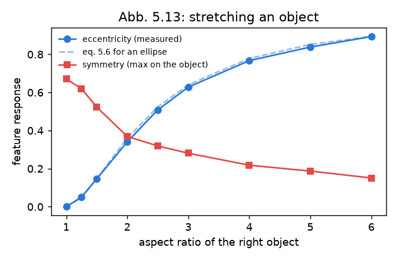
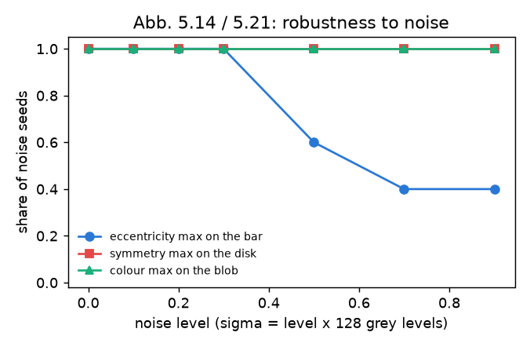
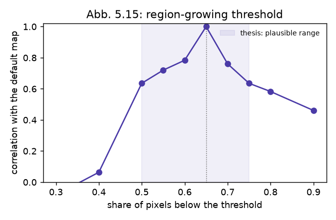
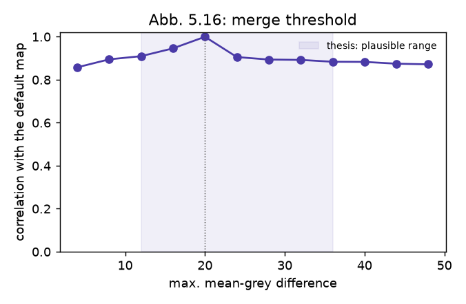
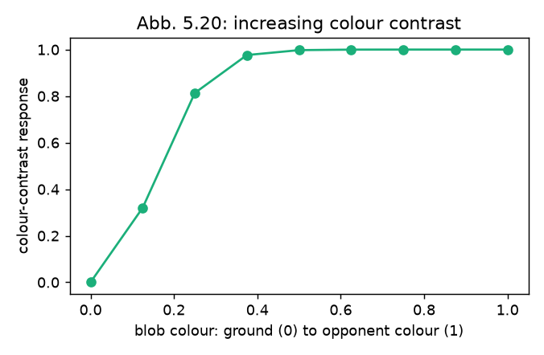

# Replication dossier — the dissertation's findings, re-run (M10)

*Track: **replication** (docs/adr/0005). First version 2026-09-20; symmetry
ported and re-run 2026-09-21. Every number here is printed by one command:*

```bash
eval/replication.py --all        # CPU only, ~10 min; figures land in docs/replication/figures
```

The dissertation (Backer 2004, ch. 5–6) supports its features and its selection
stage with small, concrete experiments: vary the property a feature is named
after and watch its response; add noise; sweep a parameter and look for the
range in which the result stays plausible. This dossier rebuilds those
experiments on the reimplementation and gives each a verdict:

- **replicated** — the claim holds, measured;
- **partially** — it holds in part, or only in a weaker form;
- **diverged** — it does not hold, with the reason;
- **not attempted** — and why.

The thesis's lab images are not available, so each experiment rebuilds the
*kind* of stimulus the figure describes; parameter sweeps on a natural image use
the thesis's own running example (`data/test_images/inputc.png`, the office
scene of Abb. 5.8–5.22). Feature responses are read on an absolute [0, 1] scale
(`attention --emit-features`), one feature at a time, with the thesis's
parameters and without exclusivity unless the experiment is about it.
"Divergences are findings, not failures" (roadmap M10): the first version of
this dossier found that the symmetry feature diverged (finding A); it has since
been ported from the original and the affected rows re-run.

## Summary

| # | Thesis | Claim | Verdict |
|---|---|---|---|
| 1 | Abb. 5.10 | Eccentricity is 0 for round shapes and high for elongated ones | **replicated** |
| 2a | Abb. 5.13 | Stretching an object raises its eccentricity response, monotonically | **replicated** — on the thesis's eq. 5.6 to within 0.02 |
| 2b | Abb. 5.13 | … and lowers its symmetry response | **replicated** after the symmetry port (0.67 → 0.15, monotone); *diverged* before it (finding A) |
| 3a | Abb. 5.14 | The eccentricity maximum stays on its object under added noise | **replicated** up to σ ≈ 38 grey levels; degrades beyond |
| 3b | Abb. 5.14 | The symmetry maximum stays on its object under added noise | **replicated** after the port — on the object at every noise level, up to σ ≈ 115; *diverged* before it (finding A) |
| 4 | Abb. 5.15 | Eccentricity segmentation is plausible for a growth threshold of 0.5–0.75 | **partially** — stable in 0.5–0.75 as claimed, but less flat than the thesis suggests (map correlation 0.64–0.78 with the default) |
| 5 | Abb. 5.16 | … and for a merge threshold of 12–36 (default 20) | **replicated** — correlation ≥ 0.88 over the whole range 4–48 |
| 6 | Abb. 5.20 | The colour-contrast response grows with the colour difference | **replicated** — monotone; saturates early |
| 7 | Abb. 5.21 | The colour-contrast maximum is robust to added noise | **replicated** — on the object at every noise level tested |
| 8 | Abb. 5.22 | Colour contrast is insensitive to `cc_add` / `cc_mult` over a broad range; only clearly different values change the salient regions (ball, picture) | **replicated** — and the same two regions are the salient ones |
| 9 | Abb. 5.34 | Exclusivity lowers the saliency of common orientations / colours relative to unique ones | **replicated** |
| 10 | Abb. 6.14 | Object identity survives temporary occlusion when several objects are tracked | **partially** — different architecture; see the H1 occlusion regime |
| — | Abb. 5.28–5.32, 5.33, 5.35, 6.10–6.13, §9.3 | stereo variation / noise / threshold, superposition, 2D vs 3D integration, field dynamics, flanker and early-vs-late selection | **not attempted** (below) |

## The findings

### 1 · Abb. 5.10 — simple shapes — replicated

| Shape | measured | eq. 5.6 |
|---|---|---|
| disk | 0.000 | 0 |
| square | 0.000 | 0 |
| ellipse, axes 2:1 | 0.354 | 0.360 |
| bar, 8:1 | 0.934 | 0.940 |

"0 for a round object and 1 for a line-shaped one and therefore already suitably
normalized as a saliency measure" — yes. (Before the 2026-09 port the same
ellipse scored 0.87, from a different formula, on segments that ignored the
image.)

### 2 · Abb. 5.13 — stretching an object



A reference disk on the left; on the right an object of constant area stretched
from 1:1 to 6:1. **Eccentricity** rises monotonically and lies on
((a² − 1)/(a² + 1))² — the thesis's eq. 5.6 for an ellipse — to within 0.02 at
every step. **Symmetry** falls monotonically, 0.67 → 0.62 → 0.52 → 0.37 → … →
0.15 ("immer geringere Salienzwerte") — the two features trade places exactly as
the thesis's figure shows. *(Before the symmetry port it went 0.67 → 0.50 →
0.87 → 0.82: not monotone, higher at the end than at the start.)*

### Finding A — the symmetry feature did not peak on symmetric objects (found 2026-09-20, fixed 2026-09-21)

*What the first version of this dossier found.* For a single bright disk on a grey ground the symmetry map has responses inside
the disk *and equally strong ones about 80 px to either side of it*, in empty
space; its global maximum is off the object for every disk size tried (radius
12, 24, 40), without any noise. This is the "symmetry fires in the empty space
between the disks" that the video study met (`docs/VLM_VIDEO.md`) — here
isolated.

The cause is not the summation core, which is a line-for-line port of the
original `symmetry_intern` (the sum over the two opposite boxes is *additive*, so
an edge on one side alone already contributes about half of a true symmetry).
It is what happens afterwards. The original works on an absolute scale — Gabor
magnitudes clipped at 255, then a fixed offset of 60 subtracted from each radius
band — which removes exactly those one-sided half-responses. The
reimplementation instead normalizes every radius band to its own maximum and
applies *relative* thresholds (0.3 / 0.5 / 0.65) plus a "≥ 2 radii" consistency
weight, over three pyramid scales with radii up to 30 px at 1/8 resolution (240
px in the image; the thesis's Tab. 5.1 has radii 6–15 at one scale). With no
absolute reference, a one-sided response at a coarse scale is as strong as a
true centre, and appears as a ring around every object.

*The fix.* The combination step was ported from the original
(`feature/symmetry.C`, thesis Tab. 5.1): a working image of at most 256 px,
quadrature Gabor energy on an absolute scale (a full-contrast step edge = 1),
radii 6–15 in adjoining bands of 3 at the working size and its two halvings, a
fixed clip offset of 60/255, scales combined by maximum. A lone disk now peaks
at its centre (0.43 / 0.82 / 0.99 for radius 12 / 24 / 40), a single straight
edge — the one-sided case — gives 0.08, and on the thesis's running example the
map peaks on the ball. One thing the sources do not settle is the gain of the
original Gabor implementation, which fixes what "60 of 255" means; the
calibration chosen is documented in `symmetry_feature.h`.

*Consequences.* Symmetry is a third of the thesis profile, so the H1
confirmatory run and the M11 human-scanpath run were repeated with the ported
feature (H1 on a fresh block of seeds); both documents say which numbers are
which.

### 3 · Abb. 5.14 / 5.21 — noise



Normally distributed noise, σ = level × 128 grey levels, five seeds per level.
The eccentricity maximum stays on the bar up to level 0.3 (σ ≈ 38) and is lost
for half the seeds beyond; the colour-contrast maximum stays on the blob at
every level, up to σ ≈ 115 (the blob-minus-ground contrast falls only from 1.00
to 0.91). The symmetry maximum stays on the disk at every level as well, with
the bar in the scene or without. (The figure is from the re-run.)

*A side finding:* eccentricity histogram-equalizes its input, as the original
does. On a synthetic image with three grey levels that maps a *bright* object
and a dominant ground to nearly the same grey (225 vs 128 become 255 vs ~237);
their difference then passes the merge criterion (max. 20) and the object
dissolves into the ground. The experiment uses a dark bar for that reason. On
natural images, with full histograms, this does not arise — but it is a trap for
synthetic stimuli, H1's scenes included.

### 4, 5 · Abb. 5.15 / 5.16 — the two eccentricity thresholds

 

On the running example, the correlation of the eccentricity map with the map at
the thesis's default. **Merge threshold** (max. mean-grey difference, default
20, thesis: plausible 12–36): ≥ 0.88 everywhere from 4 to 48 — insensitive, as
claimed, and over a wider range than claimed. **Growth threshold** (share of
pixels counted as area, default 0.65, thesis: plausible 0.5–0.75): 0.64–0.78
inside the claimed range, collapsing below 0.5 (0.06 at 0.4) and declining
slowly above 0.75. The claimed range is the right one; "plausible" in the
thesis is a visual judgement of the segmentation, and a pixel-wise map
correlation is a stricter reading than that — hence *partially*.

### 6 · Abb. 5.20 — colour contrast variation — replicated



A blob whose colour moves from the ground's green to red: the response rises
monotonically, 0.00 → 0.32 → 0.81 → 0.98 → 1.00. It saturates after a third of
the way — the sigmoid of eq. 5.12 with β = 3 on a contrast scale of 32 MTM units
is steep — which the thesis's own argument ("high values are rare overall")
intends.

### 8 · Abb. 5.22 — cc_add and cc_mult — replicated

Mean response in the two regions the thesis names, on the running example
(default: cc_add 8, cc_mult 5):

| cc_add | 2 | 4 | **8** | 12 | 16 | 24 | 32 |
|---|---|---|---|---|---|---|---|
| ball | 0.57 | 0.70 | **0.71** | 0.72 | 0.71 | 0.70 | 0.69 |
| picture | 0.39 | 0.70 | **0.93** | 0.92 | 0.89 | 0.63 | 0.04 |
| map correlation with default | 0.68 | 0.90 | 1 | 0.93 | 0.91 | 0.86 | 0.50 |

| cc_mult | 0 | 2 | **5** | 8 | 12 | 20 |
|---|---|---|---|---|---|---|
| ball | 0.12 | 0.44 | **0.71** | 0.71 | 0.69 | 0.69 |
| picture | 0.20 | 0.91 | **0.93** | 0.89 | 0.86 | 0.82 |
| map correlation with default | 0.34 | 0.88 | 1 | 0.92 | 0.89 | 0.87 |

"Ball und Bild" are the salient regions here as in the thesis, and they stay so
for cc_add 4–16 and cc_mult 5–20; only clearly different values (cc_add 32: the
picture merges into the wall; cc_mult 0: the variance term is gone and textured
regions shatter) change the picture — "erst bei deutlich veränderter Wahl der
Parameter", as the thesis says. The variance term earns its place: without it
the ball's response drops from 0.71 to 0.12.

### 9 · Abb. 5.34 — exclusivity — replicated

| Scene | odd / common, plain | odd / common, c = 1.1 | thesis factor for 5 vs 1 |
|---|---|---|---|
| five vertical bars, one horizontal | 1.03 | **1.51** | 1.1⁴ = 1.46 |
| five muted green blobs, one red | 1.03 | **2.13** | 1.46 before the sigmoid |

The odd one out gains by the factor the formula predicts for orientation; for
colour the sigmoid that follows (eq. 5.12) stretches the ratio further.

### 10 · Abb. 6.14 — tracking several objects through occlusion — partially

The thesis compares variants of its neural fields. The reimplementation tracks
identity in the *object files* of the second stage, not in the field, so the
figure is not reproduced as such; its question — does identity survive a
temporary occlusion — is measured by the H1 study's occlusion regime (speed 20,
10-frame occlusion, 30 scenes): **3.6 distinct labels per attended object with
the thesis's nearest-centroid correspondence, 1.7 with persistent identity**
(`docs/DYNAMIC_IOR_STUDY.md`). With the thesis's correspondence identity is
*not* reliably kept; the opt-in extensions are what make it hold.

## Not attempted, and why

| Thesis | Finding | Why not yet |
|---|---|---|
| Abb. 5.28, 5.30, 5.32 | stereo: distance variation, noise, variance threshold | needs rendered stereo pairs with controlled disparity; the stereo feature is a port with a behavioural test, so this is the likeliest next *replicated* |
| Abb. 5.33, 5.35 | superposition; 2D vs 3D integration | qualitative figures on lab stereo imagery |
| Abb. 6.10–6.13 | field dynamics: two maxima (repulsion from distance 10, merging from 5), per-feature weighted field systems, several salient objects, local inhibition in 3D | need the field driven by synthetic activation directly (a C++ harness, not the image CLI); the systems of several fields with global inhibition (6.11, 6.12) are not implemented |
| §9.3.2, §9.3.3 | flanker compatibility; early vs late selection | qualitative demonstrations |

## What the dossier says about the reimplementation

- The three static features, all ported from the original sources in 2026-09 —
  **eccentricity, colour contrast and symmetry — reproduce every thesis finding
  tested**, quantitatively where the thesis gives an equation. Exclusivity does
  too.
- The dossier earned its keep on its first run: it found that symmetry, the one
  feature not yet re-ported, answered beside objects instead of on them.
- Identity through occlusion holds only with the extensions, not with the
  thesis's correspondence — consistent with H1.

Replication-track definition of done (ADR-0005): ~~fix symmetry~~ → re-run H1
and M11 with it (in progress) → the stereo experiments → tag `replication-v1`.
