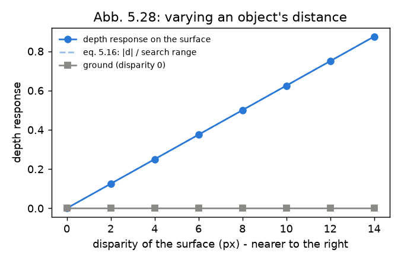
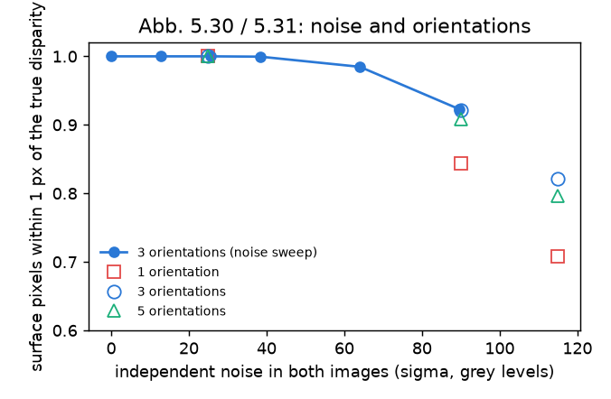
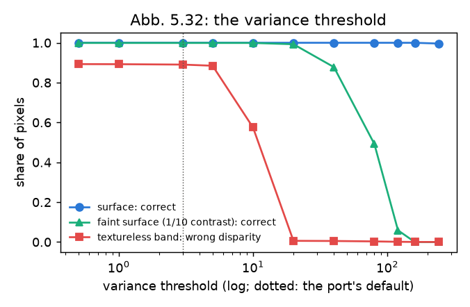
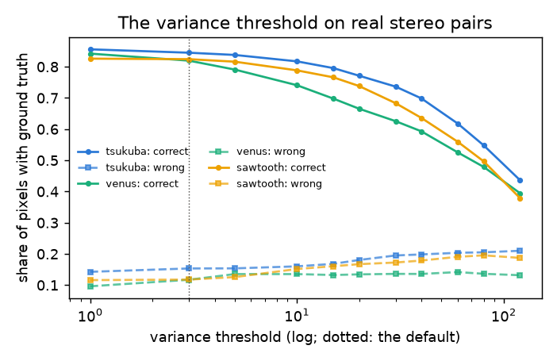
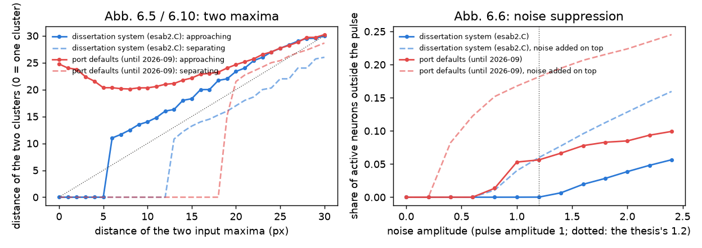
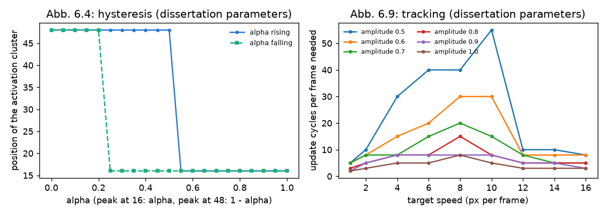
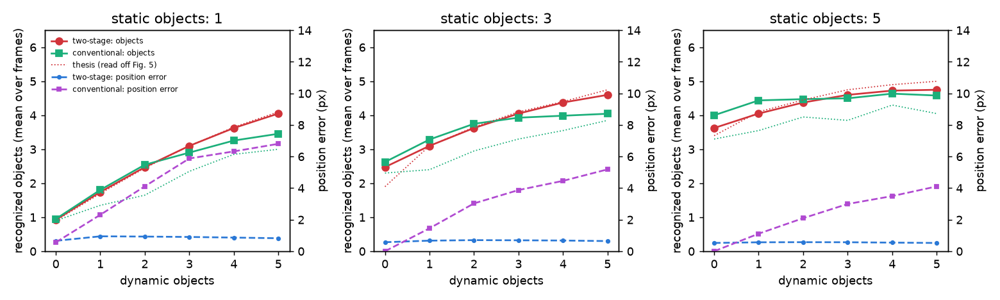

# Replication dossier — the dissertation's findings, re-run (M10)

*Track: **replication** (docs/adr/0005). First version 2026-09-20; symmetry
ported and re-run, the stereo experiments and the field dynamics added,
2026-09-21. Every number here is printed by one command:*

```bash
eval/replication.py --all        # CPU only, ~15 min; figures land in docs/replication/figures
```

The dissertation (Backer 2004, ch. 5–6) supports its features and its selection
stage with small, concrete experiments: vary the property a feature is named
after and watch its response; add noise; sweep a parameter and look for the
range in which the result stays plausible. This dossier rebuilds those
experiments on the reimplementation and gives each a verdict:

- **replicated** — the claim holds, measured;
- **partially** — it holds in part, or only in a weaker form;
- **diverged** — it does not hold, with the reason;
- **not attempted** — and why.

The thesis's lab images are not available, so each experiment rebuilds the
*kind* of stimulus the figure describes; parameter sweeps on a natural image use
the thesis's own running example (`data/test_images/inputc.png`, the office
scene of Abb. 5.8–5.22). Feature responses are read on an absolute [0, 1] scale
(`attention --emit-features`), one feature at a time, with the thesis's
parameters and without exclusivity unless the experiment is about it.
"Divergences are findings, not failures" (roadmap M10): the first version of
this dossier found that the symmetry feature diverged (finding A); it has since
been ported from the original and the affected rows re-run.

## Summary

| # | Thesis | Claim | Verdict |
|---|---|---|---|
| 1 | Abb. 5.10 | Eccentricity is 0 for round shapes and high for elongated ones | **replicated** |
| 2a | Abb. 5.13 | Stretching an object raises its eccentricity response, monotonically | **replicated** — on the thesis's eq. 5.6 to within 0.02 |
| 2b | Abb. 5.13 | … and lowers its symmetry response | **replicated** after the symmetry port (0.67 → 0.15, monotone); *diverged* before it (finding A) |
| 3a | Abb. 5.14 | The eccentricity maximum stays on its object under added noise | **replicated** up to σ ≈ 38 grey levels; degrades beyond |
| 3b | Abb. 5.14 | The symmetry maximum stays on its object under added noise | **replicated** after the port — on the object at every noise level, up to σ ≈ 115; *diverged* before it (finding A) |
| 4 | Abb. 5.15 | Eccentricity segmentation is plausible for a growth threshold of 0.5–0.75 | **partially** — stable in 0.5–0.75 as claimed, but less flat than the thesis suggests (map correlation 0.64–0.78 with the default) |
| 5 | Abb. 5.16 | … and for a merge threshold of 12–36 (default 20) | **replicated** — correlation ≥ 0.88 over the whole range 4–48 |
| 6 | Abb. 5.20 | The colour-contrast response grows with the colour difference | **replicated** — monotone; saturates early |
| 7 | Abb. 5.21 | The colour-contrast maximum is robust to added noise | **replicated** — on the object at every noise level tested |
| 8 | Abb. 5.22 | Colour contrast is insensitive to `cc_add` / `cc_mult` over a broad range; only clearly different values change the salient regions (ball, picture) | **replicated** — and the same two regions are the salient ones |
| 9 | Abb. 5.34 | Exclusivity lowers the saliency of common orientations / colours relative to unique ones | **replicated** |
| 11 | Abb. 5.28 | The depth response follows an object's distance | **replicated** — the estimated disparity equals the true one at every step |
| 12 | Abb. 5.29 | Depth is found in a random-dot stereogram | **replicated** — the square exists only as a disparity and is recovered completely |
| 13 | Abb. 5.30 | Under independent noise the disparity estimate "changes only in a very small range" | **replicated** — 10.0 → 9.9 px at σ ≈ 90 grey levels, *without* the multi-scale scheme the thesis credits for it |
| 14 | Abb. 5.31 | Several near-vertical orientations help; beyond one, the choice matters little | **replicated** |
| 15 | Abb. 5.32 | Only very high variance thresholds drop correct results; very low ones admit wrong pixels on structureless surfaces | **replicated** on the synthetic scene; on real pairs (Middlebury) a low threshold is simply best — the default stays |
| 15b | on Abb. 5.25 | "In the great majority of regions the disparity is determined correctly" | **replicated** on independent real data: 82–85% of pixels within 1 px on three Middlebury pairs |
| 16 | Abb. 6.4 | Hysteresis: the activation cluster changes place only after the formerly weaker input is clearly stronger | **replicated** with the dissertation system's field parameters (switch at α = 0.55 rising, held down to 0.25 falling); *diverged* with the port's defaults (finding B) |
| 17 | Abb. 6.5 | Bifurcation: from a certain distance two maxima give two clusters | **replicated** |
| 18 | Abb. 6.6 | Noise suppression: for a pulse of amplitude 1, only signal-caused activation up to noise amplitude 1.2 | **replicated** exactly with the dissertation parameters (zero outside the pulse up to 1.2, first activation at 1.4; zero-mean noise); *diverged* with the port's defaults |
| 19 | Abb. 6.8 | A stable state is reached in about 10 cycles | **replicated** — 10 cycles |
| 20 | Abb. 6.9 | Tracking a target in noise: within limits ~10 update cycles per frame suffice; weak (0.5) and fast targets are the limit | **replicated** with the dissertation parameters; *diverged* with the port's defaults (most moving targets lost) |
| 21 | Abb. 6.10 | Two approaching maxima: repulsion, then merging below distance 5; no oscillation | **replicated** with the dissertation parameters (merge at 5, one clean transition, re-split only at 13); *diverged* with the port's defaults (never merge) |
| 22 | §9.2, Abb. 9.2 (WAPCV 2003, Fig. 5) | The two-stage model keeps a better world model than a conventional inhibition-map model as soon as objects move: more recognized objects, position error < 0.5 px against 0.5–5 px | **partially** — the two-stage model's curve is the thesis's, to within 0.01 of its optimum; position error 0.5–0.95 px against up to 7; but it is ahead only from three dynamic objects on, because the conventional baseline built from the description is stronger than the thesis's |
| 10 | Abb. 6.14 | Object identity survives temporary occlusion when several objects are tracked | **partially** — different architecture; see the H1 occlusion regime |
| — | Abb. 5.33, 5.35, 6.11–6.13, §9.3 | superposition, 2D vs 3D integration, multi-field systems and the 3D field, flanker and early-vs-late selection | **not attempted** (below) |

## The findings

### 1 · Abb. 5.10 — simple shapes — replicated

| Shape | measured | eq. 5.6 |
|---|---|---|
| disk | 0.000 | 0 |
| square | 0.000 | 0 |
| ellipse, axes 2:1 | 0.354 | 0.360 |
| bar, 8:1 | 0.934 | 0.940 |

"0 for a round object and 1 for a line-shaped one and therefore already suitably
normalized as a saliency measure" — yes. (Before the 2026-09 port the same
ellipse scored 0.87, from a different formula, on segments that ignored the
image.)

### 2 · Abb. 5.13 — stretching an object


A reference disk on the left; on the right an object of constant area stretched
from 1:1 to 6:1. **Eccentricity** rises monotonically and lies on
((a² − 1)/(a² + 1))² — the thesis's eq. 5.6 for an ellipse — to within 0.02 at
every step. **Symmetry** falls monotonically, 0.67 → 0.62 → 0.52 → 0.37 → … →
0.15 ("immer geringere Salienzwerte") — the two features trade places exactly as
the thesis's figure shows. *(Before the symmetry port it went 0.67 → 0.50 →
0.87 → 0.82: not monotone, higher at the end than at the start.)*

### Finding A — the symmetry feature did not peak on symmetric objects (found 2026-09-20, fixed 2026-09-21)

*What the first version of this dossier found.* For a single bright disk on a grey ground the symmetry map has responses inside
the disk *and equally strong ones about 80 px to either side of it*, in empty
space; its global maximum is off the object for every disk size tried (radius
12, 24, 40), without any noise. This is the "symmetry fires in the empty space
between the disks" that the video study met (`docs/VLM_VIDEO.md`) — here
isolated.

The cause is not the summation core, which is a line-for-line port of the
original `symmetry_intern` (the sum over the two opposite boxes is *additive*, so
an edge on one side alone already contributes about half of a true symmetry).
It is what happens afterwards. The original works on an absolute scale — Gabor
magnitudes clipped at 255, then a fixed offset of 60 subtracted from each radius
band — which removes exactly those one-sided half-responses. The
reimplementation instead normalizes every radius band to its own maximum and
applies *relative* thresholds (0.3 / 0.5 / 0.65) plus a "≥ 2 radii" consistency
weight, over three pyramid scales with radii up to 30 px at 1/8 resolution (240
px in the image; the thesis's Tab. 5.1 has radii 6–15 at one scale). With no
absolute reference, a one-sided response at a coarse scale is as strong as a
true centre, and appears as a ring around every object.

*The fix.* The combination step was ported from the original
(`feature/symmetry.C`, thesis Tab. 5.1): a working image of at most 256 px,
quadrature Gabor energy on an absolute scale (a full-contrast step edge = 1),
radii 6–15 in adjoining bands of 3 at the working size and its two halvings, a
fixed clip offset of 60/255, scales combined by maximum. A lone disk now peaks
at its centre (0.43 / 0.82 / 0.99 for radius 12 / 24 / 40), a single straight
edge — the one-sided case — gives 0.08, and on the thesis's running example the
map peaks on the ball. One thing the sources do not settle is the gain of the
original Gabor implementation, which fixes what "60 of 255" means; the
calibration chosen is documented in `symmetry_feature.h`.

*Consequences.* Symmetry is a third of the thesis profile, so the H1
confirmatory run and the M11 human-scanpath run were repeated with the ported
feature (H1 on a fresh block of seeds); both documents say which numbers are
which.

### 3 · Abb. 5.14 / 5.21 — noise


Normally distributed noise, σ = level × 128 grey levels, five seeds per level.
The eccentricity maximum stays on the bar up to level 0.3 (σ ≈ 38) and is lost
for half the seeds beyond; the colour-contrast maximum stays on the blob at
every level, up to σ ≈ 115 (the blob-minus-ground contrast falls only from 1.00
to 0.91). The symmetry maximum stays on the disk at every level as well, with
the bar in the scene or without. (The figure is from the re-run.)

*A side finding:* eccentricity histogram-equalizes its input, as the original
does. On a synthetic image with three grey levels that maps a *bright* object
and a dominant ground to nearly the same grey (225 vs 128 become 255 vs ~237);
their difference then passes the merge criterion (max. 20) and the object
dissolves into the ground. The experiment uses a dark bar for that reason. On
natural images, with full histograms, this does not arise — but it is a trap for
synthetic stimuli, H1's scenes included.

### 4, 5 · Abb. 5.15 / 5.16 — the two eccentricity thresholds

 

On the running example, the correlation of the eccentricity map with the map at
the thesis's default. **Merge threshold** (max. mean-grey difference, default
20, thesis: plausible 12–36): ≥ 0.88 everywhere from 4 to 48 — insensitive, as
claimed, and over a wider range than claimed. **Growth threshold** (share of
pixels counted as area, default 0.65, thesis: plausible 0.5–0.75): 0.64–0.78
inside the claimed range, collapsing below 0.5 (0.06 at 0.4) and declining
slowly above 0.75. The claimed range is the right one; "plausible" in the
thesis is a visual judgement of the segmentation, and a pixel-wise map
correlation is a stricter reading than that — hence *partially*.

### 6 · Abb. 5.20 — colour contrast variation — replicated


A blob whose colour moves from the ground's green to red: the response rises
monotonically, 0.00 → 0.32 → 0.81 → 0.98 → 1.00. It saturates after a third of
the way — the sigmoid of eq. 5.12 with β = 3 on a contrast scale of 32 MTM units
is steep — which the thesis's own argument ("high values are rare overall")
intends.

### 8 · Abb. 5.22 — cc_add and cc_mult — replicated

Mean response in the two regions the thesis names, on the running example
(default: cc_add 8, cc_mult 5):

| cc_add | 2 | 4 | **8** | 12 | 16 | 24 | 32 |
|---|---|---|---|---|---|---|---|
| ball | 0.57 | 0.70 | **0.71** | 0.72 | 0.71 | 0.70 | 0.69 |
| picture | 0.39 | 0.70 | **0.93** | 0.92 | 0.89 | 0.63 | 0.04 |
| map correlation with default | 0.68 | 0.90 | 1 | 0.93 | 0.91 | 0.86 | 0.50 |

| cc_mult | 0 | 2 | **5** | 8 | 12 | 20 |
|---|---|---|---|---|---|---|
| ball | 0.12 | 0.44 | **0.71** | 0.71 | 0.69 | 0.69 |
| picture | 0.20 | 0.91 | **0.93** | 0.89 | 0.86 | 0.82 |
| map correlation with default | 0.34 | 0.88 | 1 | 0.92 | 0.89 | 0.87 |

"Ball und Bild" are the salient regions here as in the thesis, and they stay so
for cc_add 4–16 and cc_mult 5–20; only clearly different values (cc_add 32: the
picture merges into the wall; cc_mult 0: the variance term is gone and textured
regions shatter) change the picture — "erst bei deutlich veränderter Wahl der
Parameter", as the thesis says. The variance term earns its place: without it
the ball's response drops from 0.71 to 0.12.

### 9 · Abb. 5.34 — exclusivity — replicated

| Scene | odd / common, plain | odd / common, c = 1.1 | thesis factor for 5 vs 1 |
|---|---|---|---|
| five vertical bars, one horizontal | 1.03 | **1.51** | 1.1⁴ = 1.46 |
| five muted green blobs, one red | 1.03 | **2.13** | 1.46 before the sigmoid |

The odd one out gains by the factor the formula predicts for orientation; for
colour the sigmoid that follows (eq. 5.12) stretches the ratio further.

### 11–15 · Abb. 5.28–5.32 — the depth feature (added 2026-09-21)

Rendered stereo pairs with known disparity: a random-dot ground at disparity 0
and a random-dot surface shifted by *d* pixels in the right image (a nearer
surface), 256 × 256, search range 16 px, three orientations — the parameters of
`configs/thesis/stereo.yaml`. The depth response is |d| / search range (eq.
5.16), so it reads back as a disparity estimate. Random dots carry no monocular
cue: every pair is also a random-dot stereogram (Abb. 5.29).



**Distance (5.28) and the random-dot stereogram (5.29).** For d = 0, 2, …, 14
the estimated disparity on the surface is 0.0, 2.0, …, 14.0 — exact — with 100%
of the surface pixels within one pixel of the truth, and the ground at 0. The
stereogram's square (its mean grey differs from the ground's by 3 levels out of
255; there is nothing to see in either image alone) is recovered completely.



**Noise (5.30).** Independent normally distributed noise in the two images, five
seeds per level. The estimated disparity of a surface at 10 px is 10.0 up to
σ ≈ 38 grey levels, 9.99 at σ ≈ 64 (98% of pixels within 1 px) and 9.91 at
σ ≈ 90 (92%) — "the estimate changes only in a very small range", as the thesis
says. The thesis attributes this to its multi-scale scheme, which restricts the
search at high resolution by the result at low resolution; that scheme is *not*
ported (documented in `stereo_feature.h`), and the single-scale correlation with
the spatial integration of eq. 5.14 is already this robust on these stimuli. So
the finding replicates; the thesis's explanation for it is not tested here.

**Orientations (5.31).** At σ = 25 every orientation set is perfect, so the
comparison is made under strong noise. Share of surface pixels within 1 px /
share of ground pixels with a wrong disparity:

| noise σ | vertical only | + ±30° | + ±15°, ±30° |
|---|---|---|---|
| 90 | 0.84 / 0.16 | **0.92 / 0.08** | 0.91 / 0.09 |
| 115 | 0.71 / 0.31 | **0.82 / 0.20** | 0.80 / 0.22 |

"The method profits from several orientations, but apart from the case of a
single orientation the results differ only slightly" — exactly that.



**Variance threshold (5.32).** The scene gets a textureless band and a second
surface whose texture has a tenth of the contrast; both images carry a little
sensor noise (σ = 3). Thresholds up to 5 let the textureless band through — 89%
of its pixels receive a wrong disparity, the thesis's "erroneously classified
pixels … on the surface of the ball"; from about 20 the band is rejected (1%);
from 40 upwards correct pixels start to go, the faint surface first (88% at 40,
49% at 80, none at 160), while the high-contrast surface survives everything up
to 240. Both halves of the thesis's statement hold, and there is a broad window
between them.

*Calibration — checked on real stereo pairs (2026-09-21), and the first reading
corrected.* On this synthetic scene the port's default threshold (3.0) lies below
the window: it lets a band of pure sensor noise through. That suggested raising
it (the dissertation system used 75, on its own Gabor scale). Real imagery says
otherwise. Three Middlebury 2001 pairs with ground truth — Tsukuba, Venus,
Sawtooth, the ones whose disparities fit the 16-px search range at the feature's
256-px working size (`eval/replication.py --only stereo-real`) — share of pixels
with a correct disparity (within 1 px) / a wrong one / none:



| Threshold | Tsukuba | Venus | Sawtooth |
|---|---|---|---|
| 0 | 0.86 / 0.14 / 0.00 | 0.84 / 0.10 / 0.06 | 0.83 / 0.12 / 0.06 |
| **3 (default)** | **0.85 / 0.15 / 0.00** | **0.82 / 0.12 / 0.06** | **0.82 / 0.12 / 0.06** |
| 10 | 0.82 / 0.16 / 0.02 | 0.74 / 0.14 / 0.12 | 0.79 / 0.15 / 0.06 |
| 20 | 0.77 / 0.18 / 0.05 | 0.67 / 0.13 / 0.20 | 0.74 / 0.17 / 0.10 |
| 40 | 0.70 / 0.20 / 0.10 | 0.59 / 0.14 / 0.27 | 0.64 / 0.18 / 0.19 |
| 80 | 0.55 / 0.21 / 0.25 | 0.48 / 0.14 / 0.39 | 0.50 / 0.20 / 0.31 |

Raising the threshold never buys fewer wrong pixels — their share stays at
12–20% — it only discards correct ones. The reason is visible when the pixels
are split by local texture: on the 40–50% of each image with little grey-value
variation, **81–86% of the disparities are correct at threshold 0**; the spatial
integration of eq. 5.14 carries them from their textured surroundings. The
errors sit at occlusions and depth edges, which no variance threshold addresses.
A band of pure noise, as in the synthetic scene, is the one case the threshold
exists for, and real scenes here do not contain it. **The default stays at 3.0**;
the thesis's statement about Abb. 5.32 holds as the synthetic experiment shows
it, and the practical advice is the opposite of what that experiment alone
suggested: keep the threshold low.

This is also an independent check of the thesis's summary of its depth feature —
"in the great majority of regions the disparity has been determined correctly"
(on Abb. 5.25): 82–85% of all pixels with ground truth, on real pairs the
thesis never saw, with the single-scale port.

### 16–21 · Abb. 6.4–6.10 — the dynamics of the neural field (added 2026-09-21)

`build/field_dynamics` drives the 2D field with synthetic activation — no image,
no features — on a 64 × 64 field, as the thesis's experiments did, carrying the
field state from step to step where the experiment is about history. The thesis
does not give the shape of its input peaks; here they are Gaussian blobs (σ = 3
px), and every distance below depends on that choice to some degree.

### Finding B — the field ran on the wrong parameters

The port took the field's parameters from the *default arguments* of the
original's `setkernels()` / `setparameters()`: the "Backer" kernel k = 0.06,
s = 5, global inhibition 1, resting level −0.25. The dissertation system itself
(`esab2.C`, the single 2D field of thesis §6.3) configured

```
nf2d->setparameters(0.33, 8, -0.33, 30, ...);         // alpha, global inhibition, resting, beta
nf2d->set_DoG_kernels(15, 15, 3.3, 0.12, 14, 0.03);   // size, s, k, s2, k2
```

on a 64 × 64 field: a narrower excitatory centre, a separate broad inhibitory
surround, and eight times the global inhibition. The experiments were run under
both.



| Experiment | Thesis | Dissertation parameters | Port defaults |
|---|---|---|---|
| Two approaching maxima (6.10) | repulsion inside the interaction range, merging below distance 5, no oscillation | two clusters down to distance 6, **one from 5**; pushed apart by 3–5 px on the way in; one clean transition | **never merge**: the clusters stay ≥ 20 px apart even when the two input maxima coincide |
| Separating them again (6.5 / 6.10) | "would be dissolved in the other direction only when the distance is exceeded" | re-split at **13** — a hysteresis of the transition, as the thesis describes | split at 19 |
| Noise around a pulse of amplitude 1 (6.6) | only signal-caused activation up to noise 1.2, "beyond that the noise shows" | outside the pulse **0.000 up to 1.2, 0.7% at 1.4**, 5.6% at 2.4 (zero-mean noise) | 1.4% at 0.8, 5.3% at 1.0 |
| Hysteresis of two peaks α / 1 − α (6.4) | the cluster changes place only after the formerly weaker input is clearly higher | switches at **α = 0.55** rising, holds down to **α = 0.25** falling | switches at 0.35 rising — *before* the inputs are equal |
| Convergence from rest (6.8) | ~10 cycles (mean \|du\| < 0.02) | **10** | 8 |
| Does a cluster outlive its input? | — | yes (57 → 37 neurons, stable) | yes (97 → 69) |

The noise result is worth a second look: the thesis's sentence names an
amplitude, 1.2, and with the dissertation system's parameters the first
activation outside the pulse appears at the very next step after it. That is as
close as a replication of a figure without its data can get, and it identifies
both the parameters and the noise model (zero-mean) the thesis used. With noise
*added on top* of the signal instead, the same field shows 1% outside at 0.8.



**Tracking (6.9).** A target of the given amplitude crosses the field through
Gaussian noise (σ = 0.1); the field gets a fixed number of update cycles per
frame; tracking counts as correct while an activation cluster covers at least
half of the target (the thesis's criterion). Smallest number of cycles (≤ 55)
that keeps the target for the whole crossing, dissertation parameters:

| amplitude \ speed (px/frame) | 1 | 2 | 4 | 6 | 8 | 10 | 12 | 14 | 16 |
|---|---|---|---|---|---|---|---|---|---|
| 0.5 | 5 | 10 | 30 | 40 | 40 | **55** | 10 | 10 | 8 |
| 0.7 | 5 | 8 | 8 | 15 | 20 | 15 | 8 | 5 | 5 |
| 1.0 | 2 | 3 | 5 | 5 | 8 | 5 | 3 | 3 | 3 |

"Within these limits typically 10 update cycles already suffice" — yes, for
amplitudes ≥ 0.7; and "the limits show at an object amplitude of 0.5, if the
speed is high enough" — yes, up to the 55-cycle cutoff at 10 px/frame. The
thesis's other limit, "an object movement of more than 12 pixels", shows here as
a *change of regime* rather than a failure: from about 12 px per frame the
target leaves its cluster's reach between two frames, and what the overlap
criterion then measures is a fresh detection at every frame (a few cycles) —
not tracking. With the port's defaults most targets at 8 px/frame and above are
lost at any cycle count.

**Consequences.** `configs/thesis/thesis.yaml` now carries the dissertation
system's field parameters. On the thesis's running example the field then
selects one fixation per object — the picture, the ball, two shelf regions —
instead of ten fixations of which four sat on the picture's corners. What
depends on the field was re-run: the thesis profile's target coverage on
V\*Bench and the model's own scanpath in the human-gaze study (M11); H1 does not
(its second stage selects among object files, not field clusters).
`configs/modern.yaml` keeps the parameters it was measured with.

### The parameters of the original system

`esab2.C` also records what the dissertation system set for its features.
Where it differs from the thesis text, the replication profile follows the
*text* (that is what a reader can check), and the difference is listed here:

| Parameter | Thesis text | Dissertation system (`esab2.C`) | `configs/thesis/` |
|---|---|---|---|
| Field (single 2D) | qualitative | α 0.33, global 8, resting −0.33, DoG 3.3 / 0.12 / 14 / 0.03, 15 × 15, field 64 | the system's (since 2026-09-21) |
| Symmetry | radii 6–15, width 3, 12 orientations (Tab. 5.1) | offset 6, step 3, 4 bands, 12 orientations, k0 0.75, r 0.5 | the same |
| Eccentricity: growth share / variance ratio | 0.65 / 2 | 0.78 / 1.5 (4 dilations, 0.05–30 %, 4-connected) | the text's |
| Colour: cc_add / cc_mult | 8 / 5 | 12 / 6 (min 0.06 %, max 12 %, max contrast 32, no exclusivity) | the text's |
| Stereo: variance threshold / correlation cutoff | "empirical" / not mentioned | 75 / 0.75, window 12 | 3.0 / none. The system's 75 is on its own Gabor scale and cannot be transferred; on real pairs with ground truth a low threshold is best in the port's units (calibration above) |
| Feature weights (symmetry, eccentricity, colour, depth) | "identical weights ≡ 1" in the example (Abb. 5.33) | 1.2, 0.35, 1.6, 0.7 ("standard diss version": 1.25, 0.25, 1.5, 0.75) | 1.0 each |
| Default field architecture | three variants compared | the 3D field (`neuralmode = 3`) | 2D field for stills, 3D for stereo pairs |

### Text or code? — the two thesis profiles compared (2026-09-21)

Decision (Gerriet, 2026-09-21): the thesis **text's** values stay the documented
replication profile (`configs/thesis/thesis.yaml`, `attend.yaml`), because the
text is what a reader can check; the dissertation **system's** values are kept
runnable next to it (`thesis_esab2.yaml`, `attend_esab2.yaml`). Both use the
system's field parameters. They differ in the eccentricity thresholds (0.65 / 2
vs 0.78 / 1.5 and a saliency offset of 0.2), the colour thresholds (8 / 5 vs
12 / 6, sigmoid slope 3 vs 4), exclusivity (1.1 vs off) and the feature weights
(1 / 1 / 1 vs symmetry 1.2, eccentricity 0.35, colour 1.6).

Which fares better? Every benchmark the repository can run without a model,
each paired on identical items; "code − text", 95% CI:

| Benchmark | text | code | code − text |
|---|---|---|---|
| **Thesis's own feature findings** (`eval/replication.py --only text-vs-code`) | all reproduced; eccentricity on eq. 5.6 (2:1 ellipse 0.35) | all reproduced qualitatively; the saliency offset takes eccentricity off eq. 5.6 (0.19); colour loses the blob at the strongest noise level | text is the closer fit |
| V\*Bench target coverage, top 3 (191 items) | 0.152 | 0.105 | −0.047 [−0.099, +0.010] |
| … `fovea` accuracy at K = 3, legibility oracle | 0.147 | 0.099 | |
| COCO-Search18 bottom-up, found@10 (150 trials) | 0.37 | 0.34 | −0.027 [−0.100, +0.040] |
| … with the category prior | 0.42 | 0.43 | +0.013 [−0.047, +0.073] |
| H1, object-ior+id latency, standard / fast / occlusion (30 scenes each, seeds 3000–3029) | 1.73 / 1.79 / 1.92 | 1.62 / 1.77 / 1.93 | −0.12 / −0.03 / +0.01, all intervals include 0 |
| H1, object-ior+id staleness | 1.83 / 1.63 / 1.58 | 1.81 / 1.63 / 1.57 | −0.01 / +0.01 / −0.00 |
| MIT1003, the model's own scanpath, ScanMatch (200 images) | 0.545 | 0.529 | **−0.016 [−0.023, −0.008]** |
| … generic readout of the map | 0.674 | 0.668 | **−0.005 [−0.009, −0.001]** |
| … object-file readout, position agreement | 0.791 | 0.799 | **+0.008 [+0.001, +0.015]** |

**Answer: neither is decisively better; where they differ, the text's values
are ahead — slightly.** The text profile is closer to the thesis's own
equations, a little better at putting early fixations on small targets and at
agreeing with human scanpaths, and tied on search and on the dynamic-scene
study. The only place the system's values lead is the object-file readout's
position agreement on stills, by 0.008. On the running example the two colour
maps correlate at 0.92 and the eccentricity maps at 0.59 — eccentricity is where
the variants really differ, and it is also the feature with the smallest weight
in the system's profile (0.35), which is probably why so little of the
difference reaches the benchmarks.

Two things this comparison settles beyond the question asked:

- **H1 holds under both profiles, on a third fresh block of scenes.**
  Object-based IOR beats space-based IOR on latency and staleness in every
  regime under either parameter set (latency −1.2 / −4.8 / −1.4 frames with the
  text's, −1.2 / −4.4 / −1.5 with the system's). The verdict does not depend on
  which set of values is "the thesis".
- **The feature weights the dissertation system used do not matter much** at
  this resolution of measurement: down-weighting eccentricity to 0.35 and
  up-weighting colour to 1.6 changes no benchmark by more than its interval.

### 22 · Thesis §9.2, Abb. 9.1–9.2 (= WAPCV 2003, Fig. 4–5) — the world-model experiment (added 2026-09-21)

*The thesis's own quantitative test of its central claim. Missed by the first
dossier (which drew on ch. 5–6); found on reading the WAPCV 2003 paper
(`WAPCV_2003_NOTES.md`).*

Two attention models explore the same simulated master map of attention — no
features — and each has to keep a world model: which object is where. 5 × 5
objects, ≥ 14 px apart at every moment, static or moving on a straight path by
at most 2 px per axis and frame, uniform noise of half the object amplitude;
1, 3, 5 static × 0–5 dynamic objects; **50 runs of 40 frames per condition.**
Recognition is simulated: it names the object under the focus, after 3 frames
(conventional) or 4 (two-stage: one extra, to charge for the field).

- **Conventional** (after Koch & Ullman): blur, subtract the inhibition map, take
  the maximum; the identity is bound to the place where the object was selected;
  then an 8 × 8 area is inhibited, decaying by 20% per frame.
- **Two-stage:** one 2D neural field of local inhibition → its activity clusters
  → object files (the correspondence of §7.2.3) → behaviour "exploration"; the
  identity is bound to the object file and moves with its cluster.

Measures: the mean number of objects whose identity the world model holds within
20 px of the true position, and the mean position error of those.
`build/world_model`, wrapped by `eval/replication.py --only world-model`.

**What building it found first (finding B, continued).** With the field
parameters of `configs/thesis/thesis.yaml` the two-stage model *left clusters
behind*: a moving object's cluster stayed where it was, self-sustained, a second
one formed under the object, and the object file stayed with the ghost (its
position error grew to 60 px). Two more things about the dissertation system's
field, both in its sources and both missed by finding B:

| | Port (`thesis.yaml`) | Dissertation system |
|---|---|---|
| Update cycles per frame | until mean \|du\| < 0.02 — on a quiet field that is 3 cycles | **a fixed 20.** Its convergence test compared the *summed* \|du\| with 0.002, which a field with noise on its input never meets; the cycle limit was 20 |
| Input gain | 1.0 on a [0, 1] map | **0.003 on a 0–255 master map**, i.e. 0.765 |

With 20 cycles per frame the field does what the thesis says: on the development
seeds the number of activity clusters equals the number of objects in every one
of the 18 conditions, exactly, and no cluster is left behind. (The gain matters
little here.) The still-image profile is not affected — a still is relaxed from
rest to convergence, which takes about 10 cycles (finding 19) — but anything that
runs the field over a stream has to use the fixed count.

**What the sources leave open**, and what was chosen — before the confirmatory
run, on development seeds 0–9:

| Choice | Taken | Why |
|---|---|---|
| Map size | 128 × 128, the field at that resolution | 10 objects on straight 40-frame paths at ≥ 14 px do not fit into 64 × 64 |
| Velocities | uniform in [−2, 2] per axis, ≥ 0.5 px per frame; objects drawn at whole pixels | "at most 2 pixels in x and y direction" |
| Noise | uniform, peak-to-peak 0.5, **zero mean** | the thesis's field experiments used zero-mean noise (finding 18); *variant:* in [0, 0.5] |
| Conventional model: when recognition looks at the focus | **at selection** — the reading that favours the conventional model | the sources say "the identity of the selected object was returned"; *variant:* when recognition ends, by which time a moving object may have left |
| … its blur / inhibition strength | Gaussian σ 1.5 / 1.0 | the paper: "blurring the input … finding the center of the input" |
| Correspondence radius | 5 px | the field's local-maximum range *x_a* (finding 21) |

#### Prediction, written down before the confirmatory run

Seeds 1000–1049 have not been generated at the time of this commit; everything
above was settled on seeds 0–9. A difference "holds" if its paired 95% interval
over the 50 runs excludes zero.

1. **The two-stage model reaches its optimum.** Its recognized-object count is a
   function of the number of objects alone (0.93, 1.75, 2.48, 3.10, 3.62, 4.05,
   4.38, 4.60, 4.72, 4.75 for 1–10 objects: every object recognized at the first
   opportunity and never lost) to within 0.1, and lies within 0.25 of the thesis's
   curve (read off Fig. 5) in every condition. *(Refuted if it falls short of
   that function by more than 0.1 in any condition.)*
2. **Without dynamic objects the conventional model is ahead** (3 and 5 static
   objects), as the thesis says. *(Refuted if the two-stage model is ahead in a
   static-only condition.)*
3. **"With any dynamic object the two-stage model is ahead" will not replicate
   as stated.** Pooled over the static counts the two-stage model is ahead from
   3 dynamic objects on, the conventional model with 1 dynamic object, and 2 is
   close. The reason is the baseline, not the model: the conventional model here
   recognizes more objects than the thesis's did (4.0 against about 3.3 with five
   static objects, where its optimum is 4.0). *(Refuted — in the thesis's favour —
   if the two-stage model is ahead with 1 or 2 dynamic objects; refuted against
   it if it is not ahead with 4 and 5.)*
4. **Position error.** Two-stage below 1 px in every condition and below the
   conventional model's wherever there is a dynamic object; the conventional
   model's grows with the number of dynamic objects and exceeds 3 px once they
   outnumber the static ones. The thesis's "< 0.5 px in every condition" will
   *not* hold: 0.5–1.0 px (noise jitter of the cluster centroid, plus a lag behind
   moving objects). *(Refuted if the two-stage error exceeds 1 px anywhere, or is
   below 0.5 px everywhere.)*
5. **The variants.** "Late identity" moves the crossover to 2 dynamic objects;
   positive-mean noise lets noise clusters through (more clusters than objects)
   and costs the two-stage model its lead except at 5 dynamic objects.

#### Outcome (seeds 1000–1049, 50 runs per condition, 2026-09-21)



`results/replication_world_model`; two-stage minus conventional, paired over
runs, 95% CI; **bold** = interval excludes zero. "Optimum": every object
recognized at the first opportunity and never lost. "Thesis": read off Fig. 5.

| Static | Dynamic | Two-stage | optimum | thesis | Conventional | thesis | Δ recognized | Position error: two-stage / conventional (px) |
|---|---|---|---|---|---|---|---|---|
| 1 | 0 | 0.92 | 0.93 | 0.9 | 0.95 | 0.9 | **−0.02** | 0.66 / 0.56 |
| 1 | 1 | 1.74 | 1.75 | 1.7 | 1.81 | 1.35 | **−0.06** | 0.95 / 2.31 |
| 1 | 2 | 2.47 | 2.48 | 2.45 | 2.55 | 1.65 | **−0.07** | 0.93 / 4.11 |
| 1 | 3 | 3.10 | 3.10 | 3.1 | 2.90 | 2.35 | **+0.20 [+0.11, +0.29]** | 0.91 / 5.88 |
| 1 | 4 | 3.62 | 3.62 | 3.65 | 3.26 | 2.85 | **+0.37 [+0.28, +0.46]** | 0.87 / 6.33 |
| 1 | 5 | 4.05 | 4.05 | 4.1 | 3.46 | 3.0 | **+0.59 [+0.50, +0.70]** | 0.82 / 6.81 |
| 3 | 0 | 2.47 | 2.48 | 1.9 | 2.62 | 2.3 | **−0.15** | 0.57 / 0.00 |
| 3 | 1 | 3.10 | 3.10 | 3.1 | 3.29 | 2.4 | **−0.19 [−0.22, −0.15]** | 0.67 / 1.45 |
| 3 | 2 | 3.62 | 3.62 | 3.65 | 3.75 | 2.95 | **−0.12 [−0.19, −0.05]** | 0.70 / 3.03 |
| 3 | 3 | 4.05 | 4.05 | 4.1 | 3.93 | 3.3 | **+0.12 [+0.03, +0.22]** | 0.69 / 3.88 |
| 3 | 4 | 4.38 | 4.38 | 4.4 | 3.99 | 3.55 | **+0.39 [+0.26, +0.52]** | 0.68 / 4.46 |
| 3 | 5 | 4.60 | 4.60 | 4.75 | 4.04 | 3.85 | **+0.56 [+0.42, +0.69]** | 0.64 / 5.19 |
| 5 | 0 | 3.62 | 3.62 | 3.4 | 4.00 | 3.3 | **−0.38** | 0.53 / 0.00 |
| 5 | 1 | 4.05 | 4.05 | 4.1 | 4.44 | 3.55 | **−0.39 [−0.44, −0.33]** | 0.57 / 1.11 |
| 5 | 2 | 4.38 | 4.38 | 4.45 | 4.47 | 3.95 | −0.10 [−0.21, +0.01] | 0.57 / 2.09 |
| 5 | 3 | 4.60 | 4.60 | 4.75 | 4.50 | 3.85 | +0.10 [−0.01, +0.22] | 0.57 / 2.99 |
| 5 | 4 | 4.72 | 4.72 | 4.9 | 4.64 | 4.3 | +0.09 [−0.03, +0.21] | 0.55 / 3.50 |
| 5 | 5 | 4.75 | 4.75 | 5.0 | 4.58 | 4.05 | **+0.17 [+0.03, +0.32]** | 0.53 / 4.11 |

Pooled over the static counts, by number of dynamic objects (0–5): **−0.18,
−0.21, −0.10, +0.14, +0.28, +0.44**, every interval excluding zero. The number of
activity clusters equals the number of objects in every condition, exactly.

**The predictions, scored.**

1. *The two-stage model reaches its optimum* — **holds**: within 0.01 of it in all
   18 conditions. It lies within 0.25 of the thesis's curve in 17 of them; the
   exception is 3 static / 0 dynamic, where the published point (1.9) lies below
   the thesis's own value for three objects in the neighbouring panel (2.45).
2. *Without dynamic objects the conventional model is ahead* — **holds.**
3. *"Ahead with any dynamic object" does not replicate as stated* — **holds**:
   the two-stage model is ahead from three dynamic objects on, the conventional
   model with one and (not predicted that clearly) with two. With five static
   objects the lead is within the interval until there are five dynamic ones.
4. *Position error* — **holds**: two-stage 0.53–0.95 px everywhere, below the
   conventional model's wherever anything moves; the conventional model's grows
   to 4–7 px and passes 3 px once the dynamic objects outnumber the static ones.
   The thesis's "< 0.5 px in every condition" is not met.
5. *The variants* — **partly.** With the conventional model's recognition looking
   at the focus when it *ends*, two dynamic objects are a tie (+0.04 [−0.02,
   +0.11]) and the lead from three on grows (+0.29, +0.43, +0.61) — a tie, not the
   predicted crossover. Positive-mean noise does let noise clusters through (7–18
   clusters for 1–6 objects) and raises the two-stage position error to 1.7 px,
   but the lead survives at four and five dynamic objects (+0.17, +0.35), not only
   at five.

**Verdict: partially replicated — and the part that does not is the baseline's.**
The two-stage model behaves as the thesis reports, quantitatively: its curve is
the thesis's curve, it is never distracted by noise, never loses an object, and
knows where its objects are to within a pixel while the conventional model's
beliefs go stale by 4–7 px. It *scales* better with the number of dynamic
objects, as claimed. What does not replicate is "ahead as soon as anything
moves": the conventional model built here from the thesis's description
recognizes more than the thesis's did — it reaches its own optimum in static
scenes (4.00 of 4.0 with five objects; the thesis's reached about 3.3) — so the
two-stage model's extra frame per recognition is only paid back from three
moving objects on. Why the thesis's baseline fell short of its optimum the
sources do not say. The position-error claim holds in direction and size of the
gap, not at the stated 0.5 px.

### 10 · Abb. 6.14 — tracking several objects through occlusion — partially

The thesis compares variants of its neural fields. The reimplementation tracks
identity in the *object files* of the second stage, not in the field, so the
figure is not reproduced as such; its question — does identity survive a
temporary occlusion — is measured by the H1 study's occlusion regime (speed 20,
10-frame occlusion, 30 scenes): **3.6 distinct labels per attended object with
position-only correspondence, 1.7 with persistent identity**
(`docs/DYNAMIC_IOR_STUDY.md`, first confirmatory run).

*Corrected 2026-09-21.* This entry called position-only correspondence "the
thesis's". Thesis §7.2.3 also compares feature means and revives inactive files
by their features (`WAPCV_2003_NOTES.md`, finding D); that rule now exists
(`object_files.correspondence: thesis`) and was measured on a fresh block (seeds
4000–4029, occlusion regime): **2.8 labels per object position-only, 2.7 with
§7.2.3, 1.4 with persistent identity.** So the verdict stands, with the right
attribution: the thesis's rule as written — feature means taken from the saliency
feature maps, a maximum age — does not hold identity through a 10-frame
occlusion on these scenes; what does is a colour descriptor, a gate that widens
with the time unseen, and no expiry, none of which is the thesis's.

## Not attempted, and why

| Thesis | Finding | Why not yet |
|---|---|---|
| Abb. 5.33, 5.35 | superposition; 2D vs 3D integration | qualitative figures on lab stereo imagery |
| Abb. 6.11, 6.12 | systems of several 2D fields with global inhibition and per-feature weights | not implemented: the reimplementation has the single 2D field and the 3D field only |
| Abb. 6.13 | the 3D field with local inhibition on a stereo scene | the 3D field is ported and tested; a dynamics experiment like the 2D ones needs the harness extended to the depth volume |
| §9.3.2, §9.3.3 | flanker compatibility; early vs late selection | qualitative demonstrations |
| ~~§9.2, Abb. 9.1–9.2~~ → finding 22 | **the thesis's own quantitative test of its central claim:** world-model quality (recognized objects, position error) of the two-stage model against a conventional inhibition-map model, 1/3/5 static × 0–5 dynamic objects, 50 runs of 40 frames | **missed when this dossier was built** (it drew on ch. 5–6); found 2026-09-21 on reading the WAPCV paper. Fully specified and CPU-only — to be replicated as finding 22. See `WAPCV_2003_NOTES.md`, which also records that the "thesis correspondence" of finding 10 is weaker than thesis §7.2.3 and that `--attend` forms object files from saliency segments, not from the field's activity clusters |

## What the dossier says about the reimplementation

- The three static features, all ported from the original sources in 2026-09 —
  **eccentricity, colour contrast and symmetry — reproduce every thesis finding
  tested**, quantitatively where the thesis gives an equation. Exclusivity does
  too, and so does the **depth feature** (a port from the start): disparity is
  recovered exactly, robustly under noise, and its two parameters behave as the
  thesis describes.
- The **neural field reproduces the thesis's dynamics — with the parameters the
  dissertation system actually used.** The port had taken the defaults of the
  original's setter functions instead; with those the clusters never merge, noise
  leaks in early and moving targets are lost (finding B).
- The dossier earned its keep twice: it found that symmetry answered beside
  objects instead of on them (finding A), and that the field ran on the wrong
  parameters (finding B). Both looked like properties of the 2004 model until
  they were tested against the thesis's own figures.
- Identity through occlusion holds only with persistent identity, not with the
  thesis's correspondence (§7.2.3, measured as written since 2026-09-21).
- **The thesis's own test of its central claim (finding 22) replicates on the
  model's side to the second decimal** — and building it found a third thing the
  port had wrong about the field (a fixed 20 cycles per frame over a stream).
  The thesis's chain — field → activity clusters → object files — exists since
  then as an option, and H1 has been measured on it: supported inside the field's
  tracking range, not outside (`docs/DYNAMIC_IOR_STUDY.md`).

Replication-track definition of done (ADR-0005): ~~fix symmetry~~ → ~~re-run H1
and M11 with it~~ → ~~the stereo experiments~~ → ~~the field dynamics~~ (Abb.
6.4–6.10 done; 6.11–6.13 documented as not implemented / not attempted) →
~~decide on the open parameter questions~~ (decided 2026-09-21: the text's values
are the profile, the system's are a runnable sibling; compared above) →
~~the stereo variance threshold~~ (checked on real pairs 2026-09-21: the default
is right) → **tagged `replication-v1` on 2026-09-21.** The thesis profiles, the
components they select and their goldens are frozen from that tag
(`docs/adr/0005-two-tracks-replication-and-modern.md`); a later change to them
needs a replication reason and a re-run of this dossier.
