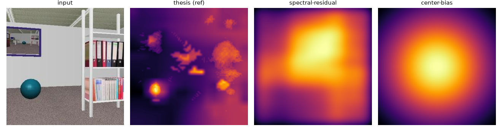

# The thesis, 20 years later

The 2004 dissertation attention model (C++ `thesis.yaml`: color / eccentricity /
symmetry through the 2D neural field) compared against modern saliency baselines
on the thesis test images. This is a *cross-model* comparison — the thesis model
is the reference and the others are scored against it — because the thesis images
have no recorded human fixations. For a ground-truth benchmark, run
`attention_eval.benchmark --dataset mit1003` once the dataset is downloaded.

Models: **thesis** (this framework), **spectral-residual** (Hou & Zhang 2007),
**center-bias** (a central Gaussian prior). A learned DeepGaze IIE adapter is
available (`attention_eval.models.deepgaze`) and plugs in as another peer once
torch and its weights are installed.

# Benchmark — cross-model agreement

Reference model: **thesis** — 4 images. Higher CC/SIM/NSS/AUC/matched and lower KL/dist/edit mean closer agreement with the reference.

| model | CC | SIM | KL | NSS@ref | AUC@ref | matched | mean dist | grid edit |
|---|---|---|---|---|---|---|---|---|
| thesis (ref) | 1.000 | 1.000 | 0.000 | – | – | 1.00 | 0.0 | 0.000 |
| spectral-residual | 0.114 | 0.665 | 0.369 | 0.212 | 0.601 | 0.10 | 11.3 | 0.975 |
| center-bias | 0.339 | 0.694 | 0.349 | 0.286 | 0.623 | 0.15 | 10.4 | 0.950 |

*Saliency maps for `inputc.png`: the input, the thesis model, and the two modern
baselines.*

Reading: the modern baselines diverge markedly from the 2004 model (low CC, ~10 %
scanpath overlap). The center-bias prior tracks the thesis model more closely than
spectral residual does, which says the thesis model carries a moderate central
tendency — unsurprising given its feature set and the field's border suppression.
